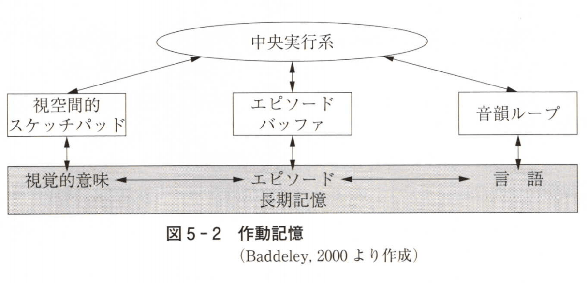
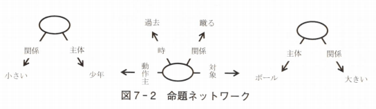

# 認知心理学

## 1. 認知心理学のプロフィール

### 1-1. 認知心理学

#### 1-1-1. 基礎的な心理学
心理学を大きく2つに分ける
- 実践的な心理学: 直接生活に役立つような心理学
  - 本当に役立つためにはそもそも心の働きの理解が必要
- 基礎的な心理学: 心の働きを解明しようとする心理学
  - 基礎的な心理学の中心となっているのが認知心理学

#### 1-1-2. 認知
- 「認知」とは何か
- 基本的には認識と同じ意味の言葉。どちらもcognition
- 物事を知ること
  - 知るためにはまず目や耳を使って外界の様子を探らなければならない
  - 17~18世紀にかけては、哲学の認識論でも盛んに知覚の問題が論じられた。
- 知覚したことを覚えていたり、その意味を考えたりすることも欠かせない
  - 記憶や思考も中心的なテーマ
- **知情意**: 「人間の心には3つの異なる部分がある」
  - 認知心理学が主に研究対象としてきたのは「知」の部分
    - 人間の知的な活動を解明することが目的
  - 近年は「意」の部分と関連の深い意識や無意識の問題についても研究が進んできた
  - 「情」に当たる感情についても、研究が盛んに行われるようになった
- 認知心理学は人間の精神活動を全体として理解しようとする「基礎的な心理学」へと脱皮しつつあると言えるかも

#### 1-1-3. 研究テーマの例 -- 立体的な世界の知覚
- 視覚は本質的な二次元的な平面像
  - 奥行きは含まれていない
  - しかし私たちが見ている外界は立体的
- この問題を解明するデモンストレーション
  - 隠された部分の知覚(Rock, 1984)
  - Bを構成している図形は同一。

#### 1-1-4. 研究テーマの例 -- 誤った目撃証言
- 青森県の弘前市で大学教授の夫人が刺殺された事件
  - 母親が犯人を目撃
  - 裁判で「犯人そっくりです」と証言したが、事件後の調書によると「常夜灯がついていただけだったので、犯人の顔はほとんど見てなかったのです」(後藤, 1979)
- この事件が時効になってから真犯人が見つかった

### 1-2. 認知心理学の概念装置

#### 1-2-1. 概念装置
- 認知心理学は人間をどのように理解しようとしているのか
- 適切な概念装置がなければ現象の理解は進まない
  - どのような学問であれ、草創期には適切な概念装置は存在しない。徐々に作り上げる。
  - 自然現象を理解するための「擬人化」
- 学問的な探求が始まってもなお人間との対比が使われ続けた例
  - **親和力(affinity)**: 「よく似た人同士は互いに惹かれ合う」という人間観察に由来

#### 1-2-2. 精神活動と概念装置
- 19世紀末に科学的な心理学が勃興し、より科学的な理解に到達しようとする努力が始まる
  - 適切な概念装置は存在しないということが明らかになった。
  - それを作り出すことも非常に難しい
- 人間の身体の働きであれば、人工物との類比で理解できる場合もある
  - 17世紀にイギリスの医師ハーヴェイはポンプとの類比によって心臓や弁の働きを説明
- 精神活動の場合は2つの理由で類比に頼ることが難しかった
  - 脳と似たものが他には見つからなかったこと
    - 脳をいくら観察しても心臓のような可動部がない。
      - どういう働きをしているのか見当をつけることもできない。
  - 知的な精神活動の場合、人間以外にはそういうことができる存在が見当たらなかったこと
    - 同じような機能を持っていてすでにその働き方がわかっている人工物はなかった
- **心身二元論**
  - 17世紀、デカルト
  - 身体: 機械論
  - 精神: 機械では理解不能

#### 1-2-3. 行動主義心理学の概念装置
- とはいえ、概念装置なしでは学問は成立しない。
- **刺戟―反応連合** という概念装置
  - 認知心理学以前に基礎的な心理学の中心を占めていた行動主義心理学
  - ロシアの生理学者パヴロフが発見した条件反射からの類比
    - 条件反射
      - 犬はメトロノームの音が聞こえただけで唾液を分泌するようになった
    - 犬は刺激と反応との間に新たな連合を形成したことになる
  - 行動主義の心理学はこの概念装置によって経験に基づいて形成される様々な行動を説明しようとした
- 行動主義心理学は学習の基本的な原理について数多くの事実を明らかにした。
  - 人間の精神活動についての理解は実際にはほとんど進まなかった
  - 刺激-反応連合という概念装置は人間の精神活動を解き明かすための適切な概念装置ではなかったということになる

#### 1-2-4. その他の概念装置
- 20世紀のはじめ、ドイツで生まれたゲシュタルト心理学
  - 刺戟-反応連合という概念装置は使用せずに近くや思考などの研究を進めていた
- **「場」** という概念装置
  - ケーラーが当時物理学の世界で最先端の話題になっていた電磁場の理論に注目
  - この概念装置も成功には程遠かった
- **群論** という概念装置
  - スイスの心理学者ピアジェ
    - 認知心理学誕生以前に、認知の研究に大きな足跡を残した
    - 子供の認知発達を研究対象
  - しかしこの数学の群論も適切な概念装置とはならなかった

#### 1-2-5. コンピュータの出現
- 電子計算機の登場
  - 1941年にアイオワ州立大学で真空管を使った初のコンピュータ(アタナソフ-ベリー・コンピュータ)が作られた。
  - 1946年にはペンシルベニア大学でENIACという巨大なコンピュータが公開された
- コンピュータが人間の脳と似ていることは誰の目にも明らかだった
  - 計算という作業
  - 人間の脳にも可動部がないが、コンピュータの方も計算をしている本体には可動部はない
  - 脳が電気的な活動をしていることはすでにわかっていたが、コンピュータも電気的に計算をしている。
- コンピュータは情報処理をしている。
  - 人間の脳も情報処理をしているのだと考えればその働きを理解することができるのではないだろうか
- 1956年にマサチューセッツ工科大学(MIT)で情報科学シンポジウムを開催した
  - 論理学の定理を証明するコンピュータプログラム(政治学出身のサイモン、数学出身のニューウェル)
  - 文法的に正しい英語の文を生み出す文法理論(言語学者チョムスキー)
  - 「不思議な数7±2」(心理学者ミラー)
    - **直接記憶範囲**
- 同年、ダートマス大学「人間が行なっている知的な作業をコンピュータにやらせるには？」」
  - 数学・工学などの多くの分野の研究者にサイモンやニューウェルも加わる
  - **人工知能(artificial intelligence)** という言葉が誕生した。

#### 1-2-6. 情報処理パラダイム
- こうした流れの中から **情報処理パラダイム(information processing paradigm)** が誕生
  - パラダイム: 「科学研究を進めるための基本的な考え方」科学史家クーン
  - 人間の知的な精神活動をコンピュータの情報処理になぞらえて理解しようとする考え方、研究方針
- この情報処理パラダイムは結果的には大成功をもたらした
  - 人間の知的な精神活動に関する理解は飛躍的に前進した

#### 1-2-7. 認知心理学の誕生
- **認知革命** という大変革
  - 心理学の領域では行動主義の心理学に変わり情報処理という概念装置を使う新しい心理学が次第に優勢になっていった。
- 心理学者ミラーに教えを受けたナイサーは1967年に『認知心理学』(Cognitive Psychology)と言う本を著した
  - それまでお互いに無関係に行われていた認知に関する様々な研究を捜し集め、情報処理という観点から一つにまとめあげた。
  - 「認知」＝「感覚入力に関する情報処理」
  - 取り上げられた研究者「自分の研究はこういう意味を持っていたのだということが初めてわかった」
- 認知心理学は学際的な性格を持っていた。
  - 認知心理学の誕生と時を同じくして **認知科学(cognitive science)** という学際的な領域が誕生
    - チョムスキーの言語理論や人工知能研究、哲学や人類学、生理学など…
    - 認知心理学は情報工学とともにこの学際領域の中で中心的な役割
  - 認知心理学と生理学が融合した **認知神経科学(cognitive neuroscience)** という分野も生まれている

#### 1-2-8. 適応論パラダイム
- ナイサーはコーネル大学に移って情報処理パラダイムを批判する異質な心理学と出会う
  - ナイサーの知覚の授業を小馬鹿にしていたTA
    - 知覚心理学者ギブソンの学生
- ギブソンは視覚の研究
  - ドイツで誕生した実験心理学で、視覚の研究は真っ暗な部屋の中で光点を見つめるというもの
  - ギブソンは人間の視覚が環境のもつ多くの特性に反応していることに気が付いた。
    - 視覚が環境のどのような特性に反応するのかを調べるためには真っ暗な部屋のような研究方法は適切ではない
- 情報処理パラダイムが人間との類比に使ったコンピュータは人間が作り上げた人工物であり、常に人間が保守点検をしなければ機能し続けることはできない
  - 一方、人間自身は進化の過程から生まれた生物であり、自ら環境に適応うして生き延びることができる。
  - 人間の視覚も環境に適応するための手段として進化してきた機能であり、環境の重要な特性を検知するという働きを持っているはず
  - コンピュータとの類比では理解できない
- 適応という観点を重視するギブソンの考え方はアメリカで生まれた **機能主義心理学(functionalism psychology)** の伝統を受け継いでいるという面もある。
- ナイサーはギブソンに共鳴するようになる
  - 日常的な場面で人間の認知を研究していくべき
  - 義烏蕪村の生態学的な視点に基づく研究は知覚に限られていたが、ナイサーは記憶の研究も生態学的な視点に基づいて行われるべきと主張
    - **日常記憶(everyday memory)** は記憶研究の重要な柱の一つとなった
- この授業では情報処理パラダイムと対比して適応論パラダイムと呼ぶ
  - 20世紀末、**進化心理学(evolutionary pscyhology)** が登場してからさらに広範な展開を見せることになった。
  - 適応論的パラダイム
    - 機能主義的心理学
      - アメリカ独自の心理学
      - 人間の精神機能 = 環境への適応の手段
      - ジェームズ、デューイ、エンジェル
    - 生態学的心理学
      - ギブソン、ナイサー
    - 進化心理学
      - 進化論(ダーウィン)、遺伝学(メンデル)
      - 進化生物学の概念装置を活用

#### 1-2-9. 進化生物学
- 進化生物学では生物の身体的な構造や機能、行動について環境に適応して生き延びていくために形成されてきた進化の産物として理解しようとする。
- 進化生物学における理解の仕方は基本的には目的論的
  - もちろん進化のプロセスは特定の目的に向かって進んでいくわけではない。
    - ダーウィンの進化論では無作為な自然選択というプロセスを通じて、適応に有利な形質が進化するとか考える
  - 特定の目的に合致した形質が進化することになるので結果的に見れば目的論的

#### 1-2-10. 進化心理学
- 進化心理学は人間の精神機能について「特定の環境に適応するために進化してきた」という目的論的な解釈
  - 高次の精神機能についても生得的なプログラムの働きとして説明することになる。
  - 進化心理学によれば、人間の祖先は数百万年前から小集団の狩猟採集生活の適応問題に個別に対処するために様々な遺伝的なプログラムが進化してきた。
    - そうした遺伝的プログラムの働きが高次の精神機能なのだと考える。
- 人間の精神機能が全て遺伝的なプログラムによって直接決定されるのは行き過ぎではないか
  - 特定の具体的な問題を考えるために遺伝的なプログラムが進化した可能性はあるが、それとは別にもっと汎用性の高い認知機能が遺伝的に進化？
- 適応には2種類
  - 先天的な遺伝プログラムを直接使う適応
  - 後天的な学習による適応

#### 1-2-11. 2つのパラダイム
- 適応論パラダイムは当初情報処理パラダイムに対するアンチテーゼとして論じられることが多かった
- 実際には適応論パラダイムと情報処理パラダイムは相容れない考え方ではない。
  - 情報処理パラダイム: How?
  - 適応論パラダイム: Why?

### 1-3 授業の内容
- 認知心理学の全貌が大体俯瞰できるように構成されている
- **高次認知** に重点を置いている
  - 入力(刺戟) -> 初期認知(知覚・注意 etc.) -> 高次認知(記憶・言語・思考 etc.) -> 出力(行動)
- 紹介することのできない研究テーマ
  - 感情ついては別の授業

## 2. 認知心理学の研究方法

### 2-1. 研究方法

#### 2-1-1. 心理学の研究方法
- 認知心理学の主要な研究方法
  - 行動研究
    - 中心的な役割
  - コンピュータ・シミュレーション
  - 脳研究

#### 2-1-2. 行動研究
- 他者の行動を調べる研究
- 実験的研究
  - 因果関係を想定し、原因を実験者が操作し、結果の変化を調べる
  - 結果: 参加者(participant, もしくは被験者subject)の行動
- 観察的研究
  - 働きかけはせずに自然な行動を観察する
  - 因果関係を究明しようとする場合もあるが、行動についての情報を得ることだけを目的とする場合もある。
  - 観察・調査・検査・面接などの方法がある

#### 2-1-3. コンピュータ・シミュレーション(computer simulation)
- コンピュータで人間を真似てみるという研究方法
- 行動研究に基づいて、理論的なモデルを作る
  - コンピュータで実行し、行動研究のデータと比較
- モデルの動作を正確に見極めるためには非常に有効な方法
- 人工知能(artificial intelligence)とも密接

#### 2-1-4. 脳研究
- 脳に損傷を負った患者を調べる方法
  - 神経心理学(neuropsychology)という分野で行われてきた
- 健常な人の脳活動を調べる方法
  - 脳の電気的な活動を調べる方法
    - 脳波
    - 表面で計測するため、正確にどこが活動しているのか見極めるのが難しい
  - 脳の血流を調べる方法
    - 脳機能イメージング
    - 認知神経科学(cognitive neuroscience)
    - 活動している部分に集まる血流を調べる方法
      - 脳活動をどれだけ正確に反映しているのか、ややはっきりしない
- 脳研究でも行動研究が重要な役割を受け持つ

### 2-2. イメージとその研究

#### 2-2-1. イメージ
- 物理現象は感覚器官で捉えることができる
  - ガリレオの実験
  - 客観的観察が可能
- イメージ(mental image)
  - 思い浮かべている本人にはたしかに見えているような気がする
  - 客観的な観察が不可能

#### 2-2-2. 内観法
- イメージを言葉で詳しく描写する
- 内観法(introspective method):
  - 意識によって自分の心を内省し、言葉で報告するという研究方法
  - 19世紀末、ドイツの実験心理学の主な研究方法
    - 内観心理学(introspective psychology)
    - 意識心理学(consciousness psychology)
- 内観法はかなり難しい作業であり、訓練が必要
  - 内観法は訓練を積んだ心理学者が行った
  - **無心像思考論争**
    - 思考には必ずイメージが伴う vs イメージを伴わない思考がある
    - それぞれの陣営が内観法によって立証しようとした。
    - 内観法は先入観や願望によって左右されることがわかった。
  - 科学的な研究方法としてはふさわしくないとみなされるようになっていった。

#### 2-2-3. 行動主義
- 20世紀初めには行動主義(behaviorism)の心理学が台頭
- 行動(刺戟stimulusと反応response)だけを研究の対象
  - 誰もが客観的に観察可能
- 意識やイメージといった内部プロセスは研究対象から外された

### 2-3. 新しいイメージ研究

#### 2-3-1. イメージ研究の復興
- 1960年代に認知心理学が勃興、イメージの研究も復活
- イメージの研究方法も行動主義心理学を継承
  - 内部プロセスの性質を積極的に推定しようとする
- カナダの心理学者ペイヴィオ(Paivio, 1969)
  - **二重符号仮説(dual-code theory)**
    - 知識の表象には言語とイメージの2種類がある
    - イメージ: 実物に似ている
    - 言葉: 実物に似ていない
  - 立証のために記憶実験。
    - 対連合学習: 事前に単語の組み合わせを覚え、刺戟語に対する反応語を答える。
    - イメージ群 > 暗記群
    - ペイヴィオの解釈
      - 記憶表象
        - 暗記群: 言語
        - イメージ群: 言語 + イメージ
      - イメージという表象システムが存在する
    - ペイヴィオ説への批判: 「イメージ＝言語」論
      - 言語的な想起手がかり
        - 暗記群: 少ない
        - イメージ群: 多い
      - 言語の表象システムしかないと仮定しても説明できる
    - ペイヴィオの方法の限界
      - ペイヴィオの実験が示したのは記憶成績の向上のみ
        - イメージと言語どちらでも説明可能

#### 2-3-2. イメージ論争
- ペイヴィオ: イメージ＝心の中の絵のようなもの
  - カナダの心理学者ピリシン(Pylyshyn, 1973): そうしたイメージの捉え方は内観に基づいたものに過ぎないと批判
  - ピリシン: イメージ＝記号列
- イメージ論争(imagery debate)
  - 認知心理学の研究方法が次第に洗練されていった

#### 2-3-3. イメージの新しい研究方法
- イメージを使う課題(刺戟)とその課題に対する答(反応)との関係からイメージの性質を推定する
- 課題: イメージを使う課題でなければならない。
  - 研究者が自分でその課題を解いてみて、イメージを使う課題であることを内観によって確認する
    - 言葉を使ったのでは解決できない、解決が難しい課題であることは特に注意を払って確認する
  - 他の研究者たちが実験参加者がイメージを使わずに解答した可能性はないか調べる。
    - 自分の内観や実験データの分析結果などに基づいて調査
    - 可能性がある場合は課題を改良するか別の課題を考案する
  - イメージの特定の性質を調べるために複数の子となった課題を使って実験を行い、それらの実験がみな同じ結論に到達すれば、イメージが使われたことはより確実になる。
- 反応: できるだけ単純な反応だけを求める
  - イメージは内観によってしか捉えられないが、その内観は信頼できない
  - 期待や願望が入り込む余地を狭める
  - 指標:正答率と反応時間
    - 反応時間(RT: response timeまたはreaction time): 感覚入力→反応出力の時間
    - 複雑な情報処理→長い反応時間
    - 反応時間の分析→情報処理の推定

### 2-4. イメージ走査の実験
- スタンフォード大学のシェパードの実験
  - (Shepard & Metzler, 1971)
  - 2つの図形の角度差が大きいほど平均反応時間が長い
  - **心的回転(mental rotation)**
    - 片方の図形のイメージを作る
    - イメージを等速で回転
    - もう1方の図形と同じ方向になったら停止
    - もう1方の図形と回転したイメージを比較
  - 「イメージは回転することができる」
    - 内観によらずに立証

#### 2-4-1. コスリンの実験
- **イメージ走査(mental scanning)**
  - ハーバード大学のコスリン(Kosslyn, Ball, & Reiser, 1978)
  - 地図の再現実験
  - 二点間の距離が長くなるほど反応時間もほぼ比例して長くなるという結果
    - 「イメージは実物の絵のような空間的な性質を持っていることが明らかになった」と主張
    - 「黒点が飛んでいくところを想像してください」と言った場合は確かに比例関係が現れた
  - 「第2の地点が地図に合ったかあどうかがわかったらすぐにボタンを押してください」といった場合
    - 反応時間はほぼ一定で、ずっと短かった
    - 黒点を移動させた方法との差分＝余分な時間で被験者は何をしていたか？
    - ピリシン: イメージの性質ではなく、物理的な世界についての知識を反映しているに過ぎない
  - コスリンの実験の欠点
    - 課題：イメージを使わないほうが容易
    - 「できるだけ早く」という要求をしなかった
  - 心的回転実験では
    - イメージの使用: 不可欠
    - 反応時間の測定: 極限状態(できるだけ速く、正確に)
- 教訓: 反応時間を測定する研究が満たすべき条件
  - 課題: 調べたい心理プロセス
    - 迅速な反応に不可欠なもの
  - 極限状態で反応
    - できるだけ速く、正確に

#### 2-4-2. 改良された実験
- イメージ走査実験から反応時間を測る実験では反応は「できるだけ速く、できるだけ正確に」という極限状態で行う必要がある
- 改良されたイメージ走査実験
  - MITのフィンクとピンカー(Finke & Pinker, 1982)
  - 枠内の4つの点を覚え、消えた後に矢印が提示された方向にあればボタンを押す。
  - この実験はイメージ表象の性質を反映しているものとかなり確実に推定することができる。
    - 点があったかを正確に判断して、できるだけすばやくボタンを押す＝極限状況
    - 点は消えており、点の位置は言葉では正確に記述することはできないため、イメージを使わなければならない
  - 実験結果は本質的にはコスリンの実験の結果と同じものになった
    - 矢印の先端と点の間の距離が長くなるほど反応時間も長くなった
    - **イメージ表象は絵のような空間的性質を備えている**

## 3. 知覚
- 視覚を取り上げる理由
  - 知覚のうち、視覚の役割が非常に大きい
  - 心理学では視覚の研究が進んでいる
  - 映像で例を提示しやすい

### 3-1. 知覚の適応的な役割
- 知覚 = 情報の入力
  - 情報＝環境についての情報(生存に不可欠)
  - 入力情報 = 適応に必要な情報のみ
- 視覚 ≠ 外界をありのままに見る

#### 3-1-1. 見えるものと見えないもの
- 人間の目は電磁波を捉えてそれを神経信号に変換する
  - 可視光は電磁波スペクトル全域のごく僅かな部分でしか無い
  - 可視光以外の電磁波を検知する必要性は高くなかった
- 蝶やミツバチは紫外線を見ることができる
  - 蜜のある部分は紫外線を反射しない
- 人間の視覚は人類の祖先が生きていくために必要だった情報はかなり正確に検知することができる
  - 立体的な世界を見ている
  - 距離の推定も正確
  - 樹上生活時代の重要性

#### 3-1-2. 「見る」ということ
- 可視光線 -> 水晶体(lens) -> 網膜(retina)
- 「見る」＝写しとった顔図を分析し、物体やその配置を特定したり、物体の性質や動きを検知したりする

### 3-2. 物体の知覚
- 環境をできるだけ正確に知覚する必要がある
  - 3次元の空間
  - 様々な物体が存在
- 実際に捉える光のパターン
  - ３次元ではない
  - 物体に分離してもいない
- 複雑な情報処理が必要
  - リアルタイムの情報
    - 網膜像
    - 生理的な情報
  - 保存されている情報
    - 生得的な知識
    - 後天的な知識
- 物体の知覚
  - 要素の抽出
  - 要素の統合

#### 3-2-1. 画像の分析
- 見るための情報処理
  - 網膜に写った画像から物体に当たる部分を切り出す＝画像を分割しなければならない
  - いきなり分割するのは難しい
- 実際の視覚システム＝画像を非常に細かく分割
  - 色々な種類の情報に符号化する
    - e.g. 明暗が接している時
      - 輝度(luminance)の違いを利用して、境界を線という要素として符号化
      - 線の傾きや動きも符号化される
  - 神経信号に符号化される情報の種類は明暗、線、傾き、運動のほかにも色、両目視差、運動視差など
    - **両目視差(binocular)**: 右目と左目の画像の間のずれ。距離を知る手がかりになる
    - **運動視差(motion parallax)**: 遠くにある物体の象は網膜上で小さく動き、近くにある物体の像は大きく動く。距離を知る手がかり。
  - 色々な種類の情報はそれぞれ専用の神経機構(**モジュール module**)によって処理されることがわかっている

#### 3-2-2. ゲシュタルト要因
- 次は細分化した画像情報をまとめあげるという手続きが必要
  - 同じ物体に属する情報はまとめるが、別の物体に属する情報はまとめないようにしなければならない
  - 環境の中に存在する規則性を利用する
- ゲシュタルト心理学は視覚が利用している様々な規則性を「要因」としてリストップ
  - 色々な規則性を組み合わせて最適なまとめ方を推定する必要がある
  - **近接の要因(factor of proximity)**
    - 近くにあるものがまとまって見えるようにする
    - 同じ物体に属する要素は近いところに位置する傾向があるという外界の規則性
  - **閉合の要因(factor of closure)**
    - ほとんどの場合、物体は閉じた輪郭を持っているという規則性
  - **良き連続の要因(factor of good continuity)**
    - 多くの物体が滑らかに連続した輪郭線を持っているという事実に対応
- 生得的な知識はゲシュタルト要因以外にも
  - **主観的輪郭**
    - 物体は連続した滑らかな連続線を持っている→物理的に存在しない輪郭線を知覚

#### 3-2-3. 物体の性質
- **運動からの構造復元(structure from motion: Wallach & O'Connell, 1953)**
  - 点の運動：平面上の運動→立体の回転を平面に投影
    - 3次元→2次元：容易
    - 2次元→3次元：情報が不足
  - 数学的には2次元の運動だけからでは3次元の運動を復元することはできない
  - 平面上の動きから立体の形を推定するためには **剛体性(rigidity)** の仮定が必要になる(Ullman, 1979)
    - 自然環境の中にある多くの物体は剛体という規則性
  - 生物の場合は部分は剛体だが全体としては剛体ではない
    - **バイオロジカル・モーション(biological motion: Johansson, 1973)**
      - 曲がり方には規則性があるので検知することができる
      - 人間の姿だけでなく樹木の形と動きも光点の動きだけから検知できる
- **運動結合**
  - 遮蔽面があると正方形が運動しているように見える。

#### 3-2-4. 見えない情報の補填
- 視覚システムは目には見えないものまで知覚している
- 不完全な「B」や「R」の文字が知覚できる
  - 遮蔽されている輪郭を視覚システムが補う
  - **アモーダル補完** : モーダルに否定のア。視覚や聴覚などの感覚の種類をモードという。モーダル：目に見える、耳に聞こえる。

### 3-3. 知識の利用

#### 3-3-1. 断片化された画像
- このような知覚の情報処理プロセス
  - 生得的なもの
  - 進化の過程で遺伝子の中に組み込まれたのではないか
- 生得的な情報処理プログラムだけでは物体が上手く切り出せないような場合には視覚システムは後天的に獲得した知識を利用
  - 断片図版(Rock, 1984)
    - 「犬が見えるはずだ」概念的な知識を使って犬の形にまとめあげ、存在しない輪郭線まで補って犬を見ることができる
    - 犬という言葉も概念も後天的

#### 3-3-2. トップダウン処理とボトムアップ処理
- **トップダウン処理(top-down processing)** もしくは **概念駆動型処理(conceptually-driven processing)**
  - 概念的な知識を使って行う情報処理
  - 知識・期待 →知覚像
  - 高次認知を初期認知の方で利用する
- **ボトムアップ処理(bottom-up processing)** もしくは **データ駆動型処理(data-driven processing)**
  - 入力情報を使って行う情報処理
  - 網膜像→知覚像
- 認知の過程ではトップダウンとボトムアップが協調して働いている
  - 一般にはトップダウン処理の役割はそれほど大きくない
  - ボトムアップ処理が中心
  - しかし、知覚から記憶、思考へと情報処理が進んでいくにつれてトップ段処理の役割は次第に増える

### 3-4. 3次元世界の知覚

#### 3-4-1. 立体視
- 網膜に投影されるのは平面画像
  - 実際の物理的な世界とよく似た世界を知覚してる
  - 平面から立体的な世界をできるだけ正確に知覚するために多種多様な情報処理
- **立体視(stereopsis)**
  - 様々な手がかりを使って立体的な世界を復元する
    - **絵画的な手がかり**: 絵で表せる手がかり。遮蔽、線遠近法、きめの勾配など。
    - 非絵画的(生理的)な手がかり: 絵で表せない手がかり。調節、輻輳、両眼視差など。

#### 3-4-2. 非絵画的な奥行き手がかり
- 絵で表せない手がかり。運動視差や両眼視差
- 網膜に投影された情報を使っているという点では絵画的な手がかりと同じ
- 全く別の情報源からも奥行きの手がかりが得られる
  - **輻輳(convergence)**
    - 近くのものをみるためには寄り目になる
    - 両眼をどれだけ回転したかが距離の手がかりになる
  - **調節(accommodation)**
    - 近くのものをみるためにはピントを合わせるために水晶体の厚みを変化させる。
    - 水晶体を支える筋肉の伸縮具合が距離の手がかりになる
  - **両眼視差**
    - 物体までの距離が近いほど両眼視差は大きくなる。
    - 両眼視差の大きさから距離を推定することができる。

#### 3-4-3. 恒常性
- 距離を知覚するとそれは大きさの補正に使われる
  - 同じ物体でも目からの距離が遠くなると網膜像は小さくなる
  - 網膜像が小さくなったからと言ってその物体が本当に縮んだわけではない
  - 物理的な世界を正確に知覚するためには網膜像の大きさに関わらず、同じ物体は同じ大きさに見えるように補正をする必要がある
  - 網膜像の大きさも知覚することができるので補正が行われていることには気が付きにくい
- **大きさの恒常性(size constancy)**: 距離の違いに関わりなく普通の大きさに見えるという現象
- **形の恒常性(form constancy)**: e.g. コップの丸い口は斜めにすると網膜像は楕円形になるが、円形に見える。
- ほかにも **明るさの恒常性(brightness constancy)** など

### 3-5. 運動の知覚

#### 3-5-1. 運動の情報
- 全体として静止している環境の中で動く物体の動きを正確に捉えることは重要
  - 運動の知覚ははじめの段階では物体知覚と同じく明暗などの情報に依存している
  - 動きを検出するためには特殊な仕組みが必要
    - e.g. 上から下に移動した場合にだけ反応するような神経細胞
- 神経細胞からの情報を総合して運動を知覚することに特化したシステムがある
  - 物体の形を知覚するためのシステムとは独立していることがわかっている

#### 3-5-2. 物体の運動と自分の運動
- 物体の運動を知覚するためには、それを自分の運動と区別する必要がある
  - **眼球運動(eye movement)**: 人間の目はたえず動いている
  - 目が動くと網膜像も動く
- 視覚システムは目・頭・体全体の動きも計算に入れている

#### 3-5-3. 自分の運動の知覚
- 自分の運動を検出することはそれ自体も非常に重要
  - **光学的流動(optical flow)** を知覚することによって環境の中で自分がどう動いているかを検知できることを発見(Gibson, 1950)
  - 内耳にある三半規管、筋肉や関節などにある自己受容感覚器などによっても捉えることができる
  - 感覚器官から送られる情報と視覚情報とを総合して自分の動きを知覚
- 大きな壁の前に立てるようになった幼児が立っているときに、その壁を幼児の方に動かすと尻餅をつく(Lee & Aronson, 1974)
  - 視覚的には自分の体が前のめりになった→補正しようと重心を後ろに移す
  - 成人は尻餅はつかないが、重心が少し後ろに移るというところは変わらない
  - この場合は真っすぐ立っていることを知らせている視覚以外の感覚器官よりも視覚情報のほうが強力なので重心を動かしてしまう

### 3-6. 知覚の情報処理

#### 3-6-1. 情報処理の複雑さ
- 知覚システムは単に網膜に外界の像を写しとっているだけではない
- 細かく分析してから、物体の形に統合し直している
  - 物理的な世界の規則性を利用したり、後天的に学習した知識の助けを借りたりすることもある

#### 3-6-2. 錯視
- **錯視(visual illusion)**: 外界を正確に知覚しそこなったときに起こる
- 錯覚: 物理的現実とは異なる知覚

## 4. 注意

### 4-1. 注意の適応的な役割

#### 4-1-1. 情報の取捨選択
- 注意の基本的な役割→感覚情報を選択すること
  - 感覚情報の量があまりに膨大なのでとても全部は処理しきれない
  - ある時点で適応的な行動に必要な情報は限られているので、無理にすべての情報を処理する必要もない
- **選択的注意(selective attention)**
- 選択的視認
  - ナイサー
  - パスとシュートの回数を数える実験
  - 派手な傘をさした女性が通り過ぎても気が付かない
  - ゴリラの実験(selective attention test)
  - **持続的注意**
    - 注意を向けない情報は認知されないが、注意を向けた情報は認知される性質

#### 4-1-2. 突発的な情報
- 特定の情報だけに注意を集中していたのではつねに適応的な行動がとれるとは限らない
- 注意は突然現れた重要な情報をキャッチするという機能も備えていなければならない

### 4-2. 視覚的注意

#### 4-2-1. 視覚的注意
- 注意は情報処理のかなり早い段階から働いている
- **視覚探索(visual search)** の実験
  - 形の違う図形をできるだけ早く見つける
  - ターゲットの形状によって図形の数の影響が顕著になる
  - **ポップアウト(pop out)**: ターゲットが目に飛び込んでくること
    - 実験では曲線のターゲットはすぐに発見できる

#### 4-2-2. 特徴統合理論
- **特徴統合理論(feature integration theory)**(Treisman & Gelade, 1980)
  - 細分化された情報(特徴)は注意を向けなくても認知することができる。
    - したがって、直線という特徴のなかの曲線という特徴はポップアウトする。
  - 特徴の検出に注意はいらないのだが、複数の特徴を結合するためには注意が欠かせない
    - 特徴は同じだが結合の仕方だけが違う場合は、一つ一つ走査。検出のための時間がかかる・
  - 網膜が捉えた画像の特定の位置に注意が注がれると、その位置にある様々な特徴(線の傾き、曲率、色など)が統合され、物体の **表象(representation)** ができあがると想定している。
    - 細分化された情報を統合する段階から注意が必要
  - 注意はスポットライトのようなもの
    - スポットライトの大きさは広げたり絞ったり、ある程度は変えることができる(Erikson & St. James, 1986)

### 4-3. 選択的注意

#### 4-3-1. 両耳分離聴
- 内観に頼らず注意を調べる実験的な研究はブロードベントとチェリーによって開始
  - ブロードベンド: ケンブリッジ大学の心理学者。認知を情報処理として理解する試みをはじめた最初の心理学者の一人
  - チェリー: イギリスの電子工学者。
- **両耳分離聴(dichotic listening)**
  - カクテルパーティ問題を調べるための実験(Cherry, 1953)
  - ２代のテープレコーダーで右耳と左耳に別々の音声。実験参加者はどちらかの耳の文章を **追唱(shadowing)** する。
    - 実験者は実験参加者がいかに努力しても90%くらいしか追唱できないようにしておく
  - チェリーが調べたのは追唱をしなかった耳に聞こえてきた文章をどれだけ認知していたのか
    - 内容は全く理解していなかったことがわかった
      - 英語→ドイツ語→英語に変えても気が付かなかった
      - テープを逆回しにした意味不明の音声を途中に挟んでも気が付かなかった
    - 同じ高さの音が続く **純音(pure tone)** を途中に挟むと声ではない音が聞こえてきたことは認知していた。
      - 男性→女性→男性の、声の変化も認知していた。

#### 4-3-2. フィルター・モデル
- **フィルター・モデル(filter model)**(Broadbent, 1958)
  - チェリーや自身の実験結果の説明を試みた
  - 人間の情報処理は大きく２段階に分かれる
    - 1.感覚器官から入ってきた情報の物理的な特性が並列的に処理される
      - 並列的: 目から入ってきた情報も耳から入ってきた情報も同時に処理される
      - この処理に注意は不要
    - フィルター
      - 必要な情報だけを第2段階へ通し、他の情報は全部シャットアウトする
      - 選別は情報の物理的な特性に基いて行う
    - 2.系列的に行われる情報処理
      - ひとつひとつの情報を順番に処理していく
      - 意味の分析
      - この処理には注意が必要
  - 両耳分離聴の実験の解釈
    - 両耳とも物理的な特性は第1段階ですべて分析される
    - 人間の声と純音では音の物理的な特性が異なる
    - 人間の声でも男性と女性の声えは物理的な特性が異なる
    - したがって、追唱していない方であっても、純音に変わったり、性別が変わると変化が検出できる
      - しかし、情報はフィルターでシャットアウトされてしまうので意味が理解できるところまではいかない
    - 英語とドイツ語、テープの逆回しなどは、物理的な特性はほとんど変わらない
      - 第1段階の分析ではその変化を検出できない

### 4-4. 分割注意

#### 4-4-1. 分割注意の実験
- フィルター・モデルと矛盾するようにみえる事実をオックスフォード大学の学部生達が報告
- **分割注意(divided attention)** の実験(Gray & Wedderburn, 1960)
  - 左耳に「Mice, 5, cheese」、右耳に「3, eat, 4」
  - ブロードベントが考案したアプローチを改良し、一つの文や句を両耳にわけた(もとは"Mice eat cheese"など)
  - 実験の結果、どちらの耳に聞こえてきた単語・数字もかなり高い割合で聞き取れていた。
- この結果はフィルター・モデルでは説明がつかないようにも見える
  - どちらの耳にも聞こえてくる情報も処理するだけの余力があるのであれば、フィルターでシャットアウトする必要はない
  - チェリーの実験にくべると課題はずっと容易であり、注意を療法の耳に振り分ける余裕があったのだと考えることができる

#### 4-4-2. 減衰モデル
- トリーズマンはチェリーの実験と同じように追唱をしなければならない実験でも、例えば右耳に聞こえてくる文章を追従していた場合、その文章の続きが左耳に聞こえてくると、そちらの方を追唱してしまう場合があることを見出した(Treisman, 1964)
- また、追唱していない左耳に自分の名前が聞こえると、それを覚えている場合があることも見出した。
- フィルター・モデルが想定しているように、追唱していない方耳に聞こえてくる文章が完全にシャットアウトされてしまうならこのようなことは起こりえない
- **減衰モデル(attenuation model)**
  - 感覚器官から入ってくる情報が物理的な特徴にもとづいて選択される
  - 選択されなかった情報は完全にシャットアウトされるのではなく、減衰されるだけ

### 4-5. 資源理論

#### 4-5-1. 同時処理の難易度
- 追唱という困難な課題を遂行している最中には注意を向けていない方の情報を検出することはやはり容易ではない
  - ノーマンはトリーズマンの実験について「重要な単語がしばしば認知されることが見出された」と記しているが実際には6%程度(Kahneman & Treisman, 1984)
- 課題があまり困難ではない場合には２つの情報処理を同時に遂行することはそれほど難しくない
  - ポズナーとボイズの実験(Posner & Boies, 1971)
    - マッチング課題と信号検出課題を同時に行う
    - 実験参加者はほぼ正確に解答をすることができた
    - 反応時間には影響が出た
      - 信号検出課題単独と比べて、マッチング課題を同時に行った場合には300ms遅くなった

#### 4-5-2. 資源理論
- **資源理論**(Kahneman,1973)
  - **資源(attentional resources; processing resources)**: 情報処理を行うのに必要な「注意」あるいは「心的努力」のこと
    - **容量(能力, capacity)** もほぼ同義に使われる
  - この資源は覚醒水準(arousal level)が高ければ多くなり、低ければ少なくなる。いずれも上限がある。
  - 追唱課題はほぼすべての資源を使わなければならなかった
  - ポズナーとボイズの実験の場合は同時に遂行することができた。
    - 両方を完璧に遂行するには資源がやや不足したので反応時間に影響が出た
    - このような影響を **干渉(interference)** という。
  - この資源理論は現在でも様々な現象を説明するために使われている。
    - 作動記憶(working memory)など。
    - 資源の正体はよくわかっていない
      - 多くの研究ではエネルギーのようなものとしてイメージされている
        - 実際、脳細胞が活動するにはエネルギーが必要で、活動している脳部位には血液が集まることが知られている。
      - コンピュータとの類比で考えるとCPUのメモリ(RAM)のようなものだとも考えることもできる
    - **二重課題法(dual-task method)**: ２つの課題を同時に遂行するという実験の方法
      - 作動記憶の研究でも使われるようになった。

### 4-6. 自動化

#### 4-6-1. 自動化と資源
- **自動化(automatization)**
  - ある作業に習熟すると注意をほとんど使わずにその作業ができるようになる
  - ある作業が自動化すると、注意資源を他の作業に使える

#### 4-6-2. 分割注意の訓練
- ナイサーが行った実験(Spelkem Hirst, & Neisser, 1976)
  - 黙読と口述筆記を同時に行う
    - この2つを同時に行うのは非常に難しい
    - 黙読だけ→500words/min、口述筆記と同時→300words/min
  - 1回1時間、週に5回の割合で続けたところ、黙読の速さは次第に回復していった
    - 6週目には黙読だけと遜色ない速度
    - 自動化

### 4-7. 注意の捕捉

#### 4-7-1. 予期せぬ事物に気づく
- 全く予期していなかった感覚情報にもすばやく注意を向けて詳しい情報処理を行う必要がある
- **注意の補足(attentional capture)**: 予期せぬ感覚情報に注意が惹きつけられること

#### 4-7-2.実験的な検証
- 注意の捕捉の実験(Posner, 1978, 1980)
  - ボックスのどちらかにターゲットが出る→参加者はキーを押す
  - 注視点を凝視→２つの内のボックスのどちらかが光る→ターゲットがどちらかに出現する
    - 光った方のボックスに出現する確率は80%
  - 手がかりなし条件と比べると、手がかりあり条件は反応時間が短い
    - ボックスが光るという手がかりに確かに注意が惹きつけられるということを示している
  - この実験でボックスが光ってからターゲットが出現するまでの時間は200msより短かった
    - 眼球を動かすまでに200ms以上かかるので、この実験では注意だけを光ったボックスの位置に移動したということになる。
    - この実験では視線とは独立に注意を移動できるということも示している

### 4-8. 意識と無意識

#### 4-8-1. 注意と意識
- 注意と意識は必ずしも完全に同じではない
- **結合錯誤(illusory conjunction)**
  - Sと|だけの画像でも$があったと錯誤
  - 特徴統合理論による説明
    - Sや|は注意を向けなくても検出できる
    - 特徴と特徴の統合を正しく検出するためには特定の位置に注意を向ける必要がある
    - この実験ではごくわずかな時間しか見ることができないので画面のすべての位置に注意を向けることはできない
      - 一方$に対するトップダウンの感度が高まっている
      - そのためSと|が結合した$が誤って認知されてしまう
    - この説明が正しいとすれば、結合錯誤が起こるのは注意が向けられなかったから
      - 他方、結合錯誤の結果、$が意識された
      - 注意はされていないが意識はされている。２つは明らかに分離している

#### 4-8-2. 意識と無意識
- 意識は情報処理の結果をモニターする役割
- 注意は情報処理を推進する役割
- 大概の場合は、情報処理の結果をモニターしながら推進すべき情報処理を決定しているので意識と注意を截然と分けることは難しい
- 心理学では意識の研究はまだあまり進んでいない。
- 意識そのものよりも無意識的な情報処理を研究対象としてきた
  - **知覚的防衛(perceptual defense)**
    - マギナスが行った研究(McGinnies, 1949)
      - 言葉を紙に書いてそれを100分の1秒くらいの非常に短い時間だけ見せ、露出時間を少しずつ長くしていく
      - **認知閾(recognition threshold)**: 言葉が読めるようになる露出時間
      - 「ペニス」のような性に関するタブー語の提示したときは認知閾が高くなった
      - マギナスの解釈
        - 露出時間が短くて意識的には見えていないときでも、実は無意識的には見えている
        - タブー語の場合はそんな言葉は見舞いとする無意識的な力が働く(知覚的防衛)
        - 見まいとしてもどうしても見えてしまうような長い露出時間になるまで意識的には見えないという状態が続く
      - ※この実験は性革命以前に行われたということを考慮する必要がある

#### 4-8-3. 知覚的防衛実験の別解釈
- 無意識の認知という解釈は不自然という立場から別解釈を提案
- 実験参加者はタブー語の場合も普通の言葉と同じ露出時間でおあんじように見えているし、意識的にも認知されている
- 余りはっきり見えないうちに「ペニス」などと応えてそれが間違っていた場合には恥ずかしいので十分にはっきり見えるようになるまで答えるのを遅らせていただけだ

#### 4-8-4. 実験方法の改善
- この批判に応えるべく、次のような実験が行われた(Erdelyi & Applebaum, 1973)
  - 画面を見せ、露出時間を少しずつ長くしていく
  - 実験参加者はユダヤ人で、ユダヤ人にとってのタブー図形(ハーケンクロイツ)が画面中央に提示されている
  - 実験参加者が報告しなければならないのは周辺の図形
  - この実験では画面の中央にタブー図形が提示された場合は、普通の図形が提示された場合に比べて、実際に認知閾が高くなった。
- このような実験が色々と行われた結果、現在では意識されなくても認知がなされる場合があるということは、かなり広く認められるようになってきた
- 無意識の認知
  - 実験結果からその存在を推測しなければならない
  - 露出時間が短くて文字の形が明瞭に見えないときは文字の部分的な特徴だけがいくつか抽出されるということが起こりうる
  - 部分的特徴に基づいて似たような複数の言葉が候補として浮かんでくるという状態になることもありうる
  - 情報処理はまだ完結していないので、これらの候補が意識にのぼることはない
  - タブー語は性との連想関係が無意識に想起され、そのため、タブー語には無意識のうちに抑制がかかり認知が遅れる
- 無意識の認知は特に不自然でも神秘的でもないということがわかる。
  - 認知心理学が明らかにしてきた人間の情報処理プロセスと矛盾しない。
    - 意味ネットワークにおける活性化の拡散という理論
    - 単語優位効果に関する研究

## 5. 記憶1：さまざまな記憶

### 5-1. 記憶の種類

#### 5-1-1. いろいろな記憶がある理由

- 人間の記憶は一種類ではない
- いろいろな種類の情報処理
  - それぞれが情報の保持＝記憶を必要としている
  - e.g. 視覚情報処理と言語情報処理
    - 処理する情報の内容も違う
    - 情報処理を司る脳の領域も違う
    - したがって、言語情報を保持している記憶だけでは、視覚情報処理を行うことはできず、視覚情報処理には独自の記憶が必要になる

#### 5-1-2. 記憶の種類

- **感覚記憶(Sensory memory)**とそれ以外の記憶(作動記憶、長期記憶)という区別
  - 感覚記憶: 眼や耳などの感覚器官から入ってきた情報をごく短いあいだ保持しておく記憶
- **作動記憶(working memory)**と**長期記憶(long-term memory)**
  - 作動記憶：すぐに消えてしまう記憶
  - 長期記憶：いつまでも残っている記憶
    - **宣言記憶(declarative memory)**と**手続き記憶(procedural memory)**
      - 宣言記憶：私達が普通記憶という言葉から思い浮かべる記憶
        - e.g.「リンゴは果物である」
        - **意味記憶(semantic memory)**と**エピソード記憶(episodic memory)**
          - 意味記憶：一般的な情報を保持している記憶
            - e.g. 「リンゴは果物である」
          - エピソード記憶：特定の時や場所で起こった出来事についての記憶
            - e.g. 「昨日は昼食にラーメンを食べた」
          - それぞれ別の記憶システムと考える研究者もいる
          - 両者を同じ記憶システムの中に保持されている別種の情報と考える研究者もいる
      - 手続き記憶：技能の記憶
        - e.g. 自転車の乗り方
        - **古典的条件づけ(classical conditioning)**を含める場合もある
      - **知覚表象システム(perceptual representation system)**
        - 宣言記憶とは異なる記憶として、プライミングという現象を説明するために提唱された
        - これについては異論も多い

#### 5-1-3. 想起意識の有無

- 長期記憶についてはシステムの違いに基づく分類の他に**想起意識(autonoetic consciousness)**の有無に基づく区別
  - **顕在記憶(explicit memory)**と**潜在記憶(implicit memory)**
  - 顕在記憶：想起意識を伴う記憶
    - e.g. 「昨日は昼食にラーメンを食べた」→「思い出した」という想起意識がある
  - 潜在記憶：想起意識を伴わない記憶
    - 実験では「想起意識を持っていないにも関わらず、その行動は情報が保持されていることをはっきり示している」という場合も見つかる

### 5-2. 感覚記憶

#### 5-2-1. 感覚情報の保持

- 感覚器官→**神経細胞(neuron)**→感覚に変換
  - 神経細胞が情報を伝えるさいにはごく僅かではあるが時間がかかる
  - したがって、感覚情報を処理するためにはその間情報を保持しておかなければならない
  - 情報処理が行われているあいだは結果として情報が保持された状態になっている
- 感覚記憶
  - アイコニック・メモリー、エコーイック・メモリー、...
  - 線香花火などで実感できる場合がある

#### 5-2-2. 感覚記憶の測定

- 感覚記憶の厳密な測定は**部分報告(partial reports)**で行われた(Sperling, 1960)
  - 行列の形で並べられた12個の文字を50ms→できるだけ多くの文字を報告
  - ３行ほど並べた場合、読めたのはせいぜい４，５個
  - 文字が消えると同時に音が聞こえ、音の高さに応じた1行だけ読めばよいという場合はほとんど常に３つの文字が読めた
    - どの行を読むのかがわかるのは文字が全部消えてから→どの行を指示されても３つの文字を読むことができた→感覚記憶には９つの文字が残っていた
  - 全部の文字を読む場合は少ない→声に出している間に感覚記憶が薄れていったと考えられる。
    - 実際、音がなるタイミングを遅らせていくと読める文字の数は減った
    - １秒もたつと部分報告の利得は消えてしまった
    - **感覚記憶は1秒と持たない**ことを示している
  - **アイコニック・メモリー(iconic memory)**：視覚的な感覚記憶
  - **エコーイック・メモリー(echoic memory)**：聴覚的な感覚記憶

### 5-3. 短期記憶

#### 5-3-1. 一時的な情報の保持

- 作動記憶と長期記憶という区別の前に、認知心理学では当初、**短期記憶(short-term memory)**と**長期記憶(long-term memory)**という区別をしていた(Atkinson & Shiffrin, 1968)
  - 短期記憶：感覚記憶ほどすぐに消えてしまうわけではないが、長期記憶よりもずっと短い時間で消える
  - 部分報告法の実験では1秒以上たっても報告できた→短期記憶に入っていた
    - アイコニック・メモリーは目に見えた映像のようなもの
    - 短期記憶に入ったものは文字のような情報になっている

#### 5-3-2. 短期記憶の容量

- 短期記憶の存在を示す実験的な証拠は数え切れないほどある
- **記憶範囲(memory span)**という簡単な実験
  - 15個の数字を読み上げる→同じ順序でできるだけたくさんの数字を言う
  - ミラーの**不思議な数7±2**
  - 短期記憶の世容量は7±2ぐらいであることを示している

#### 5-3-3. 保持していられる時間

- 短期記憶には容量の制限だけでなく、短期という時間的な制限もある
  - 数秒もすれば消えてしまい思い出せなくなる。
- **リハーサル(rehearsal)**: 覚えておきたい情報を頭の中で唱え続ける
  - リハーサルを続けている限り、1時間でも2時間でも短期記憶のなかに情報を保持しておくことができる

#### 5-3-4. 2種類のリハーサル

- リハーサルを続けると長期記憶になる場合もある
  - しかし、ただ機械的に繰り返すだけではいくら長時間リハーサルをしていても記憶が定着するとは限らないことが多くの実験で確かめられている。
- ある実験(Glenberg, Smith, & Green, 1977)
  - 4桁の数字を2秒間見せる→一定時間リハーサル→その数字を言う
  - 上記を何度も繰り返し、実験の最後にそれまで見せられた4桁の数字をすべて言うと要請(実権参加者は予期していない)
  - リハーサル2秒条件は11%、6秒条件は7%、18秒条件は13%
  - つまり、長い間リハーサルをしていれば必ず長期記憶に定着するというわけではない
- **精緻化(elaboration)**
  - 長期記憶に定着するための深い情報処理
- **精緻化リハーサル(elaborative rehearsal)**
  - 単なる反復ではない情報処理を行うリハーサル
- **維持リハーサル(maintenance rehearsal)**
  - 情報を短期記憶に保持しておくための機械的な反復

### 5-4. 作動記憶

#### 5-4-1. 「短期記憶」から「作動記憶」へ

- 短期記憶は情報を一時的に保持しておくシステムと考えれていた
- イギリスの記憶研究者バドリー(Baddeley & Hitch, 1974)は「情報の保持だけを行っているシステム」という考え方には無理があることを明らかにした。
  - 情報の保持は情報の処理の影響を受ける。
- バドリーがおこなった実験
  - 数字を記憶に保っておきながら、できるだけ正確に文の正誤判断をする
  - 覚えておく数字が3個までのときは文の正誤判断はその正確さも速さも変わらなかった
  - 数字が６個になると正誤判断の正確さは大きく低下し、格段に長い時間がかかるようになった
  - 情報の保持と処理を同じシステムが行っている
  - 情報の保持だけに特化した短期記憶というシステムでは説明がつかない
- バドリーは情報を保持しながら情報の処理も行う**作動記憶(working memory)**とうシステムがあるのではないかと考えた

#### 5-4-2. 作動記憶と処理資源

- バドリーは注意の研究をしていたカーネマン(Kahneman, 1973)が提唱した**処理資源(processing resource)**という概念を利用した
  - 作動記憶が利用できる処理資源の量は限られており、6個の数字を保持するためにたくさんの処理資源を使ってしまうと、文の正誤判断という情報処理に使える処理資源が足りなくなってしまい、その結果、判断が間違ったり遅くなったりすることになる
- 作動記憶は多くの研究者が妥当性を認めるようになり、一般的になってきた
- バドリー(Baddeley, 1986, 2000)は様々な実験結果を説明するために、作動記憶が4つのサブシステムから構成されているというモデルを提案した。

#### 5-4-3. 作動記憶のサブシステム

- **音韻ループ(phonological loop)**
  - 短期記憶にほぼ相当する
  - 音韻：言語音のこと。聴覚的な情報
  - 文や数字などを言語音のかたちで一時的に保持しておく働きをする
  - ループは情報が輪の中でぐるぐる回っているという比喩的なイメージ
    - 一周りすると情報は鮮明になる
    - 回すのをやめると情報は数秒で消えてしまう
- **視空間的スケッチパッド(visuo-spatial sketchpad)**
  - 視覚的な情報を保持する
    - 感覚記憶のような未処理or処理中の情報ではなく、処理済みの情報
    - 物体の見え、配置、動きなど
- **エピソード・バッファ(episodic buffer)**
  - バドリー(Baddeley, 2000)があとから追加したサブシステム
  - 特定の事物についての情報を保持する
  - 音韻ループと視空間スケッチパッドのなかにある同じ事物に関する情報を統合した上で、長期記憶を参照して、そこに保持されている、その事物についての情報と照合する
- **中央実行系(central executive)**
  - 作動記憶全体の制御を司る
  - 情報資源をそれぞれのサブシステムに配分したり、サブシステムに保持されている情報を使って、文の理解や推論などの情報処理を行う
- バドリーはもっと色々なサブシステムがあると考えているが、このモデルの中には実験的に確認されたものだけが組み込まれている

### 5-5. 宣言記憶

#### 5-5-1. 宣言記憶と言語

- 宣言記憶の特徴は言語と密接な関係を持っていること
  - 宣言記憶に保存されている知識は、多くの場合、容易に言葉で表すことができる
  - 宣言記憶＝言語というわけではない

#### 5-5-2. 意味記憶とエピソード記憶

- 意味記憶
  - 一般的な知識
    - e.g. 人間には手が２本ある、リンゴは果物である
  - 成人の場合、長期記憶には膨大な量のこうした知識が蓄えられている。
    - リハーサルをしなければすぐに消えてしまうというものではない。
    - 忘れてしまったと思ってもあるときふと思い出したりする
- エピソード記憶
  - 自分がした体験や出来事についての記憶
  - 時と場所についての情報を伴っていることが多い
    - e.g. 一昨日は上野動物園にパンダを見に行った
    - 一方「コロンブスは1492年にアメリカ大陸に到着した」という知識は自分が体験したことではないので意味記憶
  - 記憶の実験で調べるのは大概の場合エピソード記憶
    - e.g. 「机、窓、犬、柿…」という単語のリストを覚えるテスト
      - それらの単語を新しく覚えるわけではなく、「この実験でいま提示されたリストの中にある」ということを覚える

#### 5-5-3. 意味記憶とエピソード記憶の関係

- 意味記憶もはじめのうちはエピソード記憶だったと考えられる
  - しかし、リンゴは果物であるという情報を知ったときの情報を覚えている人はまずいない
  - 幾度となく接する情報の場合、特定の時と場所に結びついた個々の体験は思い出せなくなっていくのが普通
  - たくさんのエピソード記憶の積み重ねは意味記憶に変貌していく
- 意味記憶とエピソード記憶は別のシステムが担っていると主張する研究者もいる(Kinsbourne & Wood, 1975)
  - **健忘症(amnesia)**と呼ばれる記憶障碍のなかに、新しいことを覚えられなくなってしまうという症例が多数見られる
  - e.g. 机の意味も窓の意味も覚えているのに、「机、窓…」という単語リストは憶えることができないというひとがいる
  - 特定の体験を記憶するエピソード記憶は意味記憶と別のシステムが担っていて、エピソード記憶のシステムが損傷を受けているという解釈
- 現在のところ、健忘症の症状をもとに、意味記憶とエピソード記憶が別個のシステムであると断定してよいかどうかについては議論が続いている(Squire, 1987)
  - このような患者をよく調べてみると、子供の頃の個人的な体験は思い出すことができるという場合がある。
    - 意味記憶になっていない古いエピソード記憶は残っている。
  - このような患者は一般的な事実であっても記憶障碍が起きた後で知った場合には新たに憶えることが困難になる
    - 意味記憶にも障碍は及んでいる。

### 5-6. 手続き記憶

#### 5-6-1. 身体技能の記憶

- 手続き記憶：長期記憶のなかで、意味記憶やエピソード記憶とは大きく異なった性質を持つ記憶
- 身体技能は代表例
- 手続き記憶は長期に渡って保持される
- 手続き記憶は獲得するためにも普通かなり長期にわたる練習が必要になる
- 手続き記憶は宣言記憶とは違い、言語化が非常に難しい

#### 5-6-2. 認知技能の記憶

- 手続き技能は身体技能の記憶に限られるわけではない
- e.g. 文法にかなった文を作るという認知技能
  - 自分の母語については文法的な文を作ったり、的確な判断ができる
  - 言葉をつかうという技能には構音器官を適切に動かす身体技能だけでなく、こうした認知技能を欠かすことができない
- 認知技能の場合も獲得するためには長期間にわたって練習を積むことが必要になる

#### 5-6-3. 手続き記憶と言語

- もう一つ、認知技能について身体技能と共通しているのは言語化が難しいという点
  - ある言語の文法を正確に説明することは多数の専門家が長い年月の末に達成しようと努力する困難な目標
  - 日本語を流暢に使っている日本人は日本語の文法に関する知識を、宣言記憶としてではなく、手続き記憶として保持している
- 言語化できない認知技能が獲得できることは多数の実験で確認されている
  - **潜在学習(implicit learning)**
    - 実験者が人工的な規則を定める
      - e.g. 「Aの次にはK，Aの前にBがあるときはAの次にはM」
    - 実験参加者に規則にあてはまっているか答えさせる
    - 試行を何回も繰り返すとかなり正確に答えられるようになる
    - 大概の人はそれがどういう規則なのかを言葉で説明することはできない

### 5-7. 潜在記憶

#### 5-7-1. プライミング

- エピソード記憶は長期記憶とはいっても、わりとすぐに思い出せなくなってしまうもの

- 多くの場合、エピソード記憶が早々に想起不能になってしまうことは無数の実験によって確認されてきた

- 思い出せなくなったエピソード記憶は長期記憶から消え去ってしまったのだろうか？

- 認知心理学における記憶研究の第一人者であるタルヴィング()Tulving, Schacter, & Stark, 1982)の実験

  - 単語のリストを1語につき5秒の速度で店、できるだけたくさん覚えてもらう
  - 記憶テストは１時間後か１週間後に行う
    - 記憶テストは2種類ある。
      - 再認テスト：提示された単語が憶えたリストのなかにあったかどうかを「イエス」か「ノー」で答える
      - **単語断片完成テスト(word-fragment completion test)**：断片を見せて当てはまる単語を答えてもらう
  - 再認テストの結果は1時間後60%→1週間後20%と大きく低下
    - 「エピソード記憶は早々に想起不能になる」という、経験とも多くの実験結果とも一致している
  - 単語断片完成テストの方は１週間後でもほとんど成績が下がらなかった
    - 最初に記憶した単語の場合はテストのときに初めて出てきた単語に比べて常に10%以上成績がよかった
    - つまり、記憶が残っていた。(潜在記憶)

- **直接プライミング(direct priming)**

  - 先の材料＝後の材料
  - 単語断片完成テストのように、はじめに提示した記憶材料と同じものをテスト課題で使い、記憶が残っているかどうかを調べる方法
  - **プライム(prime)**：「呼び水」という意味。

- **関節プライミング**：先の材料≠後の材料

- **プライミング効果(priming effect)**

  - この実験のように、前にその単語を見たことが呼び水になって、後でその単語を使った課題の成績がよくなる現象
  - プライミング効果は意図的に思い出そうとして思い出せなくても、記憶が残っている場合もあるという現象
    - 潜在記憶
    - 思い出そうとして思い出せる記憶は顕在記憶という。

  

#### 5-7-2. 潜在記憶と顕在記憶

- プライミング効果として現れる潜在記憶は、エピソード記憶などの顕在記憶とはどのような関係にあるのか
- 脳に損傷を受けると新しい出来事を憶えることができないという症状を示す場合がある
  - 顕在記憶であるエピソード記憶が障碍されているということ
  - ところが、単語断片完成テストではプライミング効果がみられる(Warrington & Weiskrantz, 1974)
  - エピソード記憶とプライミング効果には脳の異なる部位が関係していることが伺える
- プライミング効果が感覚の種類に依存するという実験結果もある
  - 単語断片テストではじめに単語を見せた場合ははっきりとプライミング効果がでてくるが、単語を聞かせた場合ははっきりとしたプライミング効果が観察されにくい
  - プライミングのもとになる独自の記憶システムの存在を示唆している
- タルウィングは**知覚表象システム**という記憶システムが存在すると想定した(Schacter & Tulving, 1994)
  - はじめに単語を見せられたときには、その外見がこの知覚表象システムに保存される
    - テストでも単語の断片が視覚的に提示されるので知覚表象システムに保存されている外見に関する情報を利用することができ、プライミング効果が生じる
  - しかし、はじめに単語を聞かせられたときには知覚表象システムに保存されているのは音声に関する情報
    - テストで単語の断片が視覚的に提示されたとき、保存されている情報は役に立たず、プライミング効果が生じない
- 知覚表象システムによる説明には別の実験に基づく異論もある(Blaxton, 1989など)
  - まだ決着のついていない問題
  - イメージの研究から考えても、感覚的な情報を保存する知覚表象システムのような記憶が存在する可能性は高い

### 5-8. さまざまな記憶の結合

#### 5-8-1. 宣言記憶の性格

- 宣言記憶は進化のプロセスのなかでは最近になって発達してきた記憶ではないかと考えられている(Squire, 1987)
- 宣言記憶は言語と密接な結び付きを持っている
  - 言語は人間ならではの特徴
  - 言語のような複雑な記号システムを持っている動物は人間のほかにはいない
- 宣言記憶と他の記憶との関係
  - 宣言記憶に保存されているのは、知覚的な情報や手続き的な情報を抽象化あるいは一般化した情報
  - 抽象化された概念は言葉で表現することによって他の人間に伝達することができる
  - 逆に抽象的な概念を組み合わせることによって、一度も見たことがない事物や情景をイメージすることもできる

#### 5-8-2. 宣言記憶と作動記憶

- 宣言記憶は作動記憶とも深い関係を持っている
  - バドリーのモデル以外にも広く指示されているモデルがいくつかある。
  - コーワン(Cowan, 2005)のモデルでは、作動記憶を独立したシステムではなく、長期記憶のなかで注意が向けられ、活性化した部分だと考える
  - 作動記憶は宣言記憶のなかに保存されている抽象化された情報と関連付けるインターフェースの役割を果たしていると考えることもできる
- 宣言記憶の中に保存されている抽象化された知識は思考のような高度な情報処理の基盤になっている

## 6. 記憶2：記憶の適応的な特性

### 6-1. 記憶と適応行動

####  6-1-1. 記憶の適応的な機能

- 適応論の観点からみた記憶の役割→過去の経験を現在の適応に活かすこと
- したがって、ほとんどすべての動物は何らかの記憶を持っている
  - **本能(instinct)**：進化の過程で遺伝子に組み込まれている記憶
    - e.g. セグロカメモのヒナは親鳥のクチバシをつつけば餌をもらえると生得的に記憶している
      - ヒナは親鳥のクチバシのように黄色くて赤い斑点がある細長いものであれば、それが鉛筆であってもつついてしまう(Tinbergen, 1953)
    - 生得的な記憶では環境の変化にすばやく適切に対応することは難しい
- 人間の場合、記憶は大部分が後天的に獲得される
  - 多くの場合獲得は短時間→環境の変化にすばやく対応可能
  - 適応に役立つ情報は個人の実体験だけでなく、文化という形で蓄積されてきた情報を学習することでも獲得できる
    - 特に宣言記憶の場合は言語を利用することで効率的に獲得できる
- 記憶が適応に役立つためには「過去に得た情報のうち、現在の状況で役立つものが自然に思い出される」という仕組みが必要
  - 脳は大量のエネルギーを消費する高価な器官
  - 役立たない情報を沢山蓄えるために高価な器官を維持していたのでは生存に不利になる
  - このような観点から人間の記憶をみなおすと3つの大きな特徴がある(次項)

#### 6-1-2. 記憶の3つの特徴

- 利用可能性
  - 利用する可能性が高い情報を憶えておく
  - 意味を記憶している場合が多いのは意味的な情報のほうがあとで役立つ可能性が高いからだと考えられる
- 状況の類似性
  - 類似した状況で得た情報ほど思い出しやすい
  - 行動決定に役立つ可能性が高い
- 統合性
  - 個別的な経験よりも類似したいろいろな状況での経験を統合しておき、それを思い出す方が役立つ

### 6-2. 利用可能性

#### 6-2-1. 「写真のような」記憶

- 写真のような記憶
  - コストが嵩む
    - あとで役に立つ可能性がほとんどないものもある
  - 情報の検索が難しい
- 写実的に記憶している人を研究→少しも便利ではないことを見出した(Parker, Cahill, & McGaugh, 2006)
  - 何年前の情景でもありありと思い出すことができる
  - そうした情景が脈絡もなく浮かんでくるので、筋道立てて考えを進めることが難しい
  - 成績も悪く、日常生活も困難

#### 6-2-2. 意味の記憶と外形の記憶

- 限りある脳の容量を有効に使うためには、概念的な意味情報だけを保存しておくほうが有利

- 実際、「意味情報は思い出せるが、見かけについての情報は思い出せない」という場合の多いことが繰り返し確認されている

  - ウォナーの実験(Wanner, 1968)
    - 実験説明をしている途中で、二つの文を見せられる。説明していたのは二つの文のうちどちらか
    - 選択肢(1): markとcarefullyの順序が入れ替わる。文型だけ
      - 正答率が50%(チャンスレベル)→憶えていなかった
    - 選択肢(2): correctとyourの順序が入れ替わる。意味も変わる
      - すべての被験者が正解
  - 認知心理学を代表する研究者の一人であるJ・R・アンダーソンが大学院生時代に行った実験(Anderson, 1974)
    - 物語のなかに「宣教師は画家を銃で撃った」という一文が出てくる
      - 宣教師は画家を銃で撃った
      - 画家は宣教師に銃で撃たれた
      - 画家は宣教師を銃で撃った
      - 宣教師は画家に銃で撃たれた
    - 内容と一致しているかどうかを尋ねる質問
      - 直後群と2分後群どちらも非常に高く遅延時間の影響はほとんどなかった
    - 同じ文章かどうかを尋ねる質問
      - 直後99%、2分後56%
      - 外形の違いに関する情報はごく短時間で思い出せなくなってしまう

  

####  6-2-3. 日常的な場面の記憶

- 日常的な場面で人間の記憶を研究しようという運動を推進したナイサーは、ウォーターゲート事件の記録を利用(Neisser, 1981)
  - ニクソン大統領の法律顧問だったディーンの証言は詳細を極めていた
  - ディーンの記憶はそれほど正確ではなかった
    - 言葉遣いはもとより、場合によっては個々の発言の要点まで異なっていた
    - 大統領が事件やそのもみ消しにどのように関与していたかという基本的な事実に関しては彼の記憶は間違っていなかった

#### 6-2-4. 外形の記憶

- もちろん人間が外形を記憶できないというわけではない
- 利用可能性が高ければ外形を記憶しておくこともできる
- 言語を材料にした実験(Wanner, 1968)
  - 似たようないくつかの文の中から文章の中で実際に聞いた文を選ぶように求められた
  - 意味は同じで形だけが違う文と元の文を識別しなければならなかったときは、正答率は50%程度
  - 文章聞く前に聞いたその文を思い出せる能力をあとでテストすると予告されていた条件では正答率は80%にも達した

#### 6-2-5. 処理水準

- 意味を考えた場合は後で思い出しやすくなるのではないかと予想される
  - 実際にそうなることは数多くの実験によって確かめられている
- クレイクとタルヴィングの実験(Craik & Tulving, 1975)
  - 実権参加者は40個の単語を一つずつ見せられた。
    - 記憶の実験であることは知らされず、ただそれぞれの単語について質問のどれかに答える。(**方向付け課題 orienting task**)
  - 不意打ちの記憶テスト
    - 見せられた40語と見せられなかった40語の合計80語がランダムで提示される
    - 個々の単語について先程の質問の時に見せられた単語かどうか答えた(**再認テスト recognition test**)
    - 正答率：形態＜音韻＜意味
  - **処理水準(levels of processing)**
    - 「深い情報処理をするほどあとで思い出しやすくなる」と仮定
    - 感覚情報の処理は浅い処理
    - 意味の理解にまで到達すれば深い処理

#### 6-2-6. 自己参照効果

- **自己参照効果(self-reference effect)**
  - 自分自身に関連のある情報はあとで参照する可能性が特に高い
  - 利用可能性の基本原理から考えると自分自身に関連のある情報は特に覚えていると予想される
    - 実験で数多く報告されている
- ロジャーズらの実験(Rpgers, Kuiper, & Kirker, 1977)
  - 40個の形容詞について4種類の質問
    - 大きい文字ですか？(形態条件)
    - 「○○○」と韻を踏んでいますか？(音韻条件)
    - 「○○○」と同じ意味ですか？(意味条件)
    - あなたにあてはまりますか？(自己参照条件)
  - 記憶の実験であるとは知らされておらず、できるだけたくさん思い出すように求められた
  - 形態＜音韻＜意味＜自己参照

### 6-3. 状況の類似性

#### 6-3-1. 符号化特定性原理

- 類似した状況で得た情報を選択的に呼び出すことができれば適応に有利に働くはずである
- **符号化特定性原理(encoding specificity principle)**
  - 一緒に憶えたことは一緒に思い出しやすいという特性
  - 記憶に関する数多くの実験事実を貫く基本的な原理
  - 符号化(enocoding)：記号に変換
- 状況である場合は**文脈効果**として現れる
  - 同じ文脈→想起確率：高
  - 違う文脈→想起確率：低
  - 部屋実験
    - 騒々しい部屋と静かな部屋
    - 無意味綴り
      - エビングハウスが考案した記憶材料
    - 学習と再生テストは同じ部屋と違う部屋で行う場合がある
    - 同じ状況だと違う状況よりも倍近く再生できた
  - 外部状況だけでなく内部状況でも(状態依存記憶)

#### 6-3-2. 陸上と海中での記憶

- 符号化特定性原理を提唱したのはタルヴィング(Thomson & Tulving, 1970)
- バドリーの実験(Godden & Baddeley, 1975)
  - 陸上 or 海中で記憶→陸上 or 海中で想起
  - 同じ状況で憶えた単語の方が思い出しやすかった

#### 6-3-3. 状態依存記憶

- **気分一致効果(mood-congruence effect : Bower, Gilligan, & Monteiro, 1981)**
  - 楽しい気分の時には楽しい事柄を、悲しいときには悲しい事柄を思い出しやすい
- **気分依存効果(mood-dependency effect : Bower, Monteiro, & Gilligan, 1978)**
  - 楽しい気分の時に憶えたことは楽しい気分のときに、悲しい気分のときに憶えたことは悲しい気分のときに思い出しやすい
- 酔っ払った時に憶えたことはよっぱらいてるときに思い出しやすいという実験結果もある(Parker, Birnbaum, & Noble, 1976)
- こうした現象を一括して**状態依存記憶(state-dependent memory)**と呼ぶこともある
  - 実験(Eich et al., 1975)
    - タバコとマリファナ
    - 体の状態を学習のときと同じ状態にするとテスト成績がよくなる

#### 6-3-4. 同じ処理と違う処理

- **記銘(memorization)** : 憶えること
- **想起(recall; retrieval)** : 思い出すこと
- 処理水準説によると、記銘の時に深い処理をするほど、想起の成績は良くなるはず
- 記銘のときに浅い処理→想起のときの処理が同じ浅い処理であれば想起の成績はよくなるという事実が報告された(Morris, Bransford, & Franks, 1977)
  - クレイクとタルヴィングの実験に、記憶テストの方でも二種類の処理課題
  - 音韻再認課題の成績は意味と音韻の成績が逆転した

#### 6-3-5. 転移適切処理

- **転移適切処理の原理(principle of transfer appropriate processing : TAP)**
  - 記銘の時にした処理と想起の時にする処理が似ているほど想起の成績は良くなる
  - この原理を裏付ける実験結果は数多く報告されている
  - クレイクとタルヴィングの処理水準実験で意味の処理をしたほうが想起成績が良かったのは、想起テストが意味の処理を必要とするテストだったからだ、ということになる
    - もっとも、記銘と想起どちらでも音韻処理をした場合の想起成績は、記銘と想起どちらも意味処理をした場合の想起成績には遠く及ばないことがわかる
    - 必ずしも意味の処理をしたほうが想起成績は良くなるという処理水準説と両立し得ないわけではない

#### 6-3-6. 転移適切処理の適応的な意味

- 適応的に考える
  - いま意味に関心があるのなら、同じ意味を持った事物を思い出すことが役に立ち、いま外見に関心があるのなら、おなじ外見をもった事物を思い出すことが役に立つ

　

### 6-4. 統合性

#### 6-4-1. メモ・モデル

- 人間の記憶のイメージはメモをすることか？
- メモ・モデルは人間の記憶の実態とはかけ離れている
  - メモはもとのまま出てくる
  - メモは多少の劣化はあるかもしれないが、内容が変わってしまうことはない
    - 記録されなかった情報が付け加わるとか１枚の紙に書いたメモの内容が別の紙に書いたメモの内容と混ざりあって出てくるとかいうことはありえない

#### 6-4-2. 提示されなかった情報の「想起」

- 1930年代に記憶が上記のようなものでないことはケンブリッジ大学の記憶研究者バートレット(F.C.Bartlett)が明らかにしている
- スーリンとドゥーリングの実験(Sulin & Dooling, 1974)
  - 「キャロル・ハリスに対する専門的な援助の必要性」という文章をそのまま読ませる群とヘレン・ケラーに置き換えた群にわける
  - 1週間後の再認テストで「彼女は耳が聞こえず、口が聞けず、目が見えなかった」を混ぜた文を提示
    - 文章があったかどうか→キャロル群は5%、ヘレン・ケラー群は50%
  - 実験参加者の半数は1週間前に読んだヘレン・ケラーについての情報が、その前から持っていたヘレン・ケラーについての情報と見分けられなくなっていた

#### 6-4-3. 想起のなかの思考

- 思い出す→持っているいろいろな情報をもとにして、今直面している問題についてどのような答えが適切なのかを判断するプロセス
  - 情報を取り出すだけでなく、情報を統合する思考も必要
- ブランズフォードらの実験(Bransford, Barclay, & Franks, 1972)
  - 文を想起しようとしているあいだには、まさしく思考を行っていることを示している
  - 実権参加者は21個の文を聞かされたが、その中には次の文のどちらかが含まれていた
    - (1) 浮かんでいる1本の丸太のそばで3匹の亀が休んでおり、彼らの下では1匹の魚が泳いでいる。
    - (2) 浮かんでいる1本の丸太の上で3匹の亀が休んでおり、彼らの下では1匹の魚が泳いでいる。
  - 再認テスト
    - (3) 浮かんでいる1本の丸太のそばで3匹の亀が休んでおり、それの下では1匹の魚が泳いでいる。
      - (1)を聞いた実験参加者は聞いていないと正しく答えた
      - (2)を聞いた実験参加者は聞いたと答えた
        - 誤りだが理屈の上では(3)の文は(2)の文と矛盾しない
  - この結果は推測を実際に働かせたことを物がっている

#### 6-4-4. 記憶の捏造

- アメリカでは2003年、死刑制度の支持者だったイリノイ州の知事が同州の死刑囚全員(167名)の減刑を発表
  - ４年の任期中、死刑囚8名もの無実が証明された(松井・立石・小谷・中西, 2003)
- アメリカでは主にDNA鑑定によって囚人の無実が証明されるケースが相次いでいる
  - こうした冤罪の多くでは有罪判決の根拠として誤った目撃証言が関わっている

#### 6-4-5. 目撃証言の実験

- エリザベス・ロフタスの実験(Loftus, Miller, & Burns, 1978)
  - 自動車が走ってきて交通事故を起こすまでの一連の場面を映した３０枚のカラースライド
    - そのうち１枚は自動車が交差点で停車した場面→停止の標識が写っていた
  - 質問
    - 正情報群：「自動車が[停止]の標識で止まっていたとき、別の自動車が通過しましたか？」
    - 誤情報群：「停止」→「徐行」
  - 20分間スライドとは関係のない文章を読んでから、スライドについての記憶を調査
    - 2枚のスライドのうち、前に見たスライドを答える再認テスト
    - 「停止」と「徐行」の標識
      - 「停止」質問→正答率75%
      - 「徐行」質問→正答率41% (50%よりも低い)

#### 6-4-6. メタ記憶

- 弘前事件の場合、面通しのときの記憶が事件のときの記憶と区別できなくなっていたからではないかと考えられる
- **メタ記憶(metamemory)** : 自分の記憶の働き方についての認知
  - 「忘れないようにするためには何度も心のなかで繰り返すほうがよい」ということは大概の大人は知っている
  - 「想起された情報は関連のありそうな様々な情報を統合したものだ」という記憶の性質は普通の人のメタ記憶には含まれていない

## 7. 記憶３：知識の構造

### 7-1. 宣言記憶の構造

#### 7-1-1. 情報の組織化

- 宣言記憶はどのように整理されているのか？
  - 物理的なレベル＝神経回路でも考えることもできる
  - 情報処理のレベル→宣言記憶の中の情報は概念によって表象されていると考えられている。
    - 概念と概念のあいだの関係も一緒に保存されている

#### 7-1-2. 意味ネットワーク

- キリアン(Quillian, 1966)は概念は階層構造をなすように組織化されていると考えた
  - **意味ネットワーク(semantic network)**
    - **ノード(node, 結節点)**：概念
    - **リンク(link, 連結)**：概念と概念の関係
    - "カナリア" is a "鳥" → 「isa」リンク

#### 7-1-3. 階層構造の検証

- 人間の記憶の中で概念は本当にこのような構造を持っているのだろうか？
  - ノードの距離に応じて情報の取り出しに時間がかかるはず
- コリンズとキリアンの実験(Collins & Quillian, 1969)
  - 正誤判断：3種類の文を1つずつ
    - カナリアは歌う→1310ms
    - カナリアは羽毛を持つ→1380ms
    - カナリアは皮膚を持つ→1470ms
  - 宣言記憶の中では確かに概念は階層的に構造化されている

#### 7-1-4. 命題ネットワーク

- 意味ネットワークでは1つのノードが複数の概念を表している

  - 「皮膚」を「持つ」

- **命題ネットワーク(propositional network)**

  - **命題(proposition)**：哲学用語で場合により少しずつ意味が違う。ここでは「文が表している概念的な内容」

  - 文の形は変わっても、変わらない内容。文そのものではなくその中身。

    - これは本です
    - This is a book
    - C'est un livre

    

  - 図7-2では、便宜上、概念を言葉で表しているが、概念＝言葉ではない

    - 語彙のデータベースは別に存在している
    - 対応する概念は言葉に変換されたりリンクされていると考えられている

#### 7-1-5. 命題ネットワークの検証

- 文の内容が命題ネットワークの形で記憶されているかを調べる実験も行われている(Weisberg, 1969; Ractcliff & McKoon, 1978など)
  - 文をたくさん覚えてもらい、その後言葉を提示し連想テスト
  - 「大きな」→「少年」よりも「ボール」の方がずっと連想されやすい
    - 「ボール」→「大きい」：リンク2本
    - 「少年」→「大きい」：リンク4本
- 宣言記憶のなかでは命題ネットワークは、直接的であれ間接的であれ、すべて互いにつながっている

#### 7-1-6. スキーマ

- 共通の概念を介して総当たりで命題連結するだけでは保存されている情報を活用することは極めて困難
  - 「その生徒は学校で叱られることを覚悟した」→「学校には先生がいて、先生はときには生徒を叱ることがある」という情報を思い出すことが必要
- **スキーマ(schema)**：人工知能や認知心理学において、知識の構造を指す用語。
  - **スロット(slot)**：概念の特性。
  - **既定値(default value)**：その概念の典型例が持っている特性

#### 7-1-7. スキーマの例

- 「学校」
  - (slot : defalut value)
  - isa : 教育機関、社会組織
  - 部分：校舎、校庭
  - 成員：先生、生徒、警備員
  - 機能：教育
- isa ：上位概念を示すスロット。isaスロットによって、スキーマは階層的な概念構造を表すこともできる。
- 既定値は変更されるかもしれない。
  - 「放送大学」→校舎、校庭ではなく、「学習センター」や「スタジオ」
- スロットに入る値もまたスキーマ構造を持っている。
- このようにスキーマは連結された多数の概念から成っている
  - 基本的には膨大な命題ネットワークの一部分と考えることもできる
    - ただし、ある概念にとって、もっとも重要な概念のまとまりから構成される一部分

#### 7-1-8. 自然カテゴリー

- 「動物 ― 鳥 ― カナリア」といったカテゴリーの階層構造は命題ネットワークによってうまく表すことがっできる。
- 古典的カテゴリー：定義特性あり、人為的に形成。
  - ふつう、カテゴリーというものは何らかの特性によって定義されると考えられている
  - 「ハートのマーク」という特性→ハートのカテゴリーに入るかどうかが決まる
    - ハートマークが書いてあるのがハートのカード
    - スペードのマークが書いてあるのはハートではなくスペードのカード
  - こうした理解は、論理学的なカテゴリーの場合にはよくあてはまる。
- **自然カテゴリー(natural category)**：定義特性なし、自然に形成
  - 日常生活で使っているカテゴリー
  - どういう特性をつかってもきちんと定義することはできないことが普通
    - e.g. 鳥カテゴリ
      - 最大の特徴は「飛ぶこと」 → 飛べない鳥は多いが鳥であることに変わりはない
      - 翼 → 翼をまったくもっていないモアという鳥
      - 分類学的には鳥は微細な解剖学的構造によって定義されているが、普通の人はそんなことは知らずに鳥というカテゴリを使っている
        - カテゴリーは何か定義特性とは別の方法で出来上がっている

#### 7-1-9. メンバーの典型性

- カテゴリーが何か１つの特性で定義されているとする
  - その特性さえ備えてさえすれば、みな平等にそのカテゴリーのメンバーということになるはず
    - 実際にはカテゴリーのメンバーは平等ではない。
    - 典型性が違う。
- 自然カテゴリーについての心理学的な研究を開拓したロッシュ(Rosch, 1975)
  - おなじカテゴリーに属する様々な事例→実験参加者が典型的なメンバーだと感じられるか判断
    - 典型的 1 ↔ 7 非典型的
    - 鳥：スズメ1.18, ペリカン2.98, ペンギン4.53
  - 実験参加者に２つの絵を見せて、同じカテゴリに属するかどうかをできるだけすばやく判断
    - 反応時間：「スズメ」&「カナリア」＜「ペンギン」&「シチメンチョウ」

#### 7-1-10. スキーマによるカテゴリーの表象

- 典型性の違いがある→カテゴリーがスキーマによって表されている
  - スキーマの場合、カテゴリーは1つの特性によって画然と定義されるわけではない
  - いろいろな特性を表す多数のスロットと底に入っている既定値によって緩やかに定義される
  - 既定値をたくさん持っている事例は「鳥」だと判断され、まったくもっていない事例は「鳥」ではないと判断される
- 典型性の違い→どれだけ多くの既定値を持っているか

#### 7-1-11. スクリプト

- **スクリプト(script)**
  - よくある出来事を表すスキーマ(Schank & Abelson, 1977)
  - スクリプト＝台本
  - レストラン
    - レストランに入る→空いてる席を探す→…‥→レジに行く→勘定する→店を出る
    - 取るべき行動が時間的な順序にしたがって構造化されている
    - レストランの種類によってスクリプトは異なる
      - 高級レストラン
      - 食券
- スクリプトを用いて物事を理解したり思い出したりしていることは様々な実験によって確かめられている
  - バウワー(Bower, Black, & Turner, 1979)
    - 参加者に物語を聞かせる→再生実験
    - 主人公は基本的にスクリプトに従った行動を取るが、スクリプトの一部は明示されなかった
    - 参加者は実際には聞いていなかった部分を再生してしまった
- 異文化では自分の持っているスクリプトが通用せず適切な行動を取ることができないという事態が頻繁に起こる
  - カルチャーショックの一因

#### 7-1-12. 素朴理論

- 命題ネットワークは、概念を多様な関係で連結可能
  - カテゴリーやスクリプトのほかにも様々な種類の概念構造を織り込むことができる
- **素朴理論(native theory)**
  - 現実の世界を理解するために直感的に形成する説明のシステム
  - e.g. 「生き物は食べ物をとると大きくなる」
  - 素朴物理学、素朴生物学、人間の心理に関する**心の理論(theor of mind)**などについて研究が進められている
  - スキーマの一種と考えることもできるが、因果的な説明や自然法則を含んでいるという点で、カテゴリーや出来事を表すスキーマとは異なる特徴を持っている
  - 主に日常体験を元に形成される
    - 自分の文化で信じられている説明が親から伝えられたり、科学的な知識が学校で教えられたりして、混在していることが普通
  - 科学的な知識に由来していない部分は事実と大きく食い違うこともある
    - 螺旋状に巻かれたホースの中をたまが転がり落ちてきた。ホースから出たとき玉の軌道は？
      - 多くの人は「ホースの曲がり具合にしたがって、カーブした軌道をとって転がっていく」と答える(McCloskey, Caramazza, & Green, 1980)
      - 実際には直線軌道を取る
  - 素朴理論は日常生活をうまく導いてくれる程度には現実に即している事が多い

#### 7-1-13. 自伝的記憶

- **自伝的記憶(autobiographical memory)**
  - 自分自身に関する記憶
    - 時と場所が伴うものはエピソード記憶の性格を持った自伝的記憶
    - 特定のときと場所に結びついていないものは、意味記憶的な性格をもった自伝的記憶
- **レミニセンス・バンプ(reminiscence bump)** またはたんに **バンプ**
  - レミニセンス：追想、バンプ：盛り上がったところ
  - 高齢者が過去の体験を思い出そうとするとき、基本的には昔のことほど思い出しにくいが、10代の終わりから20代の終わりにかけての時期については比較的たくさんのことが思い出せる
  - 年齢全体の想起の割合をグラフにとると10代~20代にかけて山ができる＝レミニセンス・バンプ
  - 人生の重要な出来事がこの時期に集中していることが原因ではないかという説が有力
- **幼児期健忘(infantile amnesia)**
  - 5歳ぐらいまでのことはほとんど思い出せない事が多い
  - 出来事を理解するためのスキーマやスクリプトができていないので、あとから想起することができないという説
  - 神経系の発達がまだ十分ではないという説
- 自伝的記憶は「自己」というものが成立するうえで重要な役割を果たしている
  - **全生活史健忘(generalized amnesia)**
    - 自分が体験した過去の出来事がすべて思い出せなくなる
  - **逆行性健忘(retrograde amesia)**
    - 障碍が発生した時点から遡った一定期間の記憶だけが失われる
    - この場合も、言葉の意味や一般的な知識は思い出すことができる
  - 自伝的記憶は宣言記憶の中でも特別なまとまりをなしていることがわかる

### 7-2. 意味の生成

#### 7-2-1. 命題ネットワークによる意味の表象

- 意味記憶には概念の意味が記憶されていると考えられている
  - 意味というのは具体的にどのように表されているのか
  - 命題ネットワークを前提として考えると概念の意味は基本的には概念間の結合の仕方から生み出されていると考えることができる
    - 「鳥」「黄色い」「歌う」→黄色い歌う鳥なのだからカナリアを表している
  - 命題ネットワークのなかの概念はどれも相互に意味を規定しあっている
    - どれかが特別な地位にあって他の概念の意味を規定しているわけではない

#### 7-2-2. 公共的な意味と個人的な意味

- ある概念について知っている誰もが持っている情報＝公共的な意味
- 意味が概念間の結合から生まれるとすれば、個人的な記憶なもある概念の意味の一部を担っていることになる＝個人的な意味

#### 7-2-3. 情報処理システム全体による意味の表象

- 概念の意味は命題ネットワークのなかで閉じているわけではない
  - e.g. 「自動車」という概念は自動車の知覚情報ともつながっている
    - 見たときやエンジン音を聞いたときに、「自動車」というノードに繋がり、自動車という意味の認識が生じる
    - 運転する際の手続き記憶や筋肉を動かす運動プログラム、乗り物酔いの身体感覚などにつながっている

### 7-3. 想起

#### 7-3-1. コンピュータの想起

- 想起(retrieval)の問題
  - コンピュータは番地を使っている

#### 7-3-2. 連想記憶

- 人間の方式は**連想記憶**という方式を取っている
  - **associative memory**、もしくは**content-addressable memory**＝内容を呼び出すことができる記憶
    - 番地を介さず、直接内容を呼び出す
  - 内容の呼び出しは**活性化の拡散(spreading activation)**という方法を使う
    - ある情報の活性化＝その情報を使った情報処理が実行できる状態になること
    - この活性化は命題ネットワークの中で拡散していく
      - 隣のノードが活性化するかは確率的に決まる
      - 遠くに伝わるにつれて活性化は弱まっていく
      - したがって、ひとつのノードの活性化が拡散する範囲は命題ネットワークのごく一部にとどまる

#### 7-3-3. 間接プライミング

- 活性化の拡散を示す証拠は数多く得られている
- **間接プライミング(indirect priming)**
  - 以前触れた直接プライミング(direct priming)は先の材料＝後の材料
  - 間接プライミング：はじめに提示される単語≠あとでテストに使われる単語
  - **語彙性判断課題(lexical decision task)**
    - 「看護師」という単語を提示
    - 直後に「医者」という単語か「サコヘ」というような非単語を提示
    - 単語か非単語かを出来るだけ早く正確に判断
    - このような実験では最初に「医者」を提示したほうが、最初に「バター」を提示したときよりも短くなることが知られている(Meyer & Schvaneveldt, 1971)
  - 看護師のノードが活性化→医者のノードも活性化する
    - 医者という言葉の情報処理は促進され早くなる
    - バターは医者のノードまでは離れている
    - すなわち、この実験結果は活性化が近隣に拡散することを示している

#### 7-3-4. 連想記憶における想起

- 想起がどのように行われるか
- e.g. 「鳥」「黄色い」が提示された
  - ２つのノードが活性化すると、その両方につながっている「カナリア」のノードも活性化
  - 活性化が十分に強ければ「カナリア」という言葉が想起される
- 連想されるので「連想記憶」
- 番地を介さず、情報内容から直接アクセスするので、「内容を呼び出すことができる記憶」

#### 7-3-5. 想起方式の適応的な意味

- 連想記憶は符号化特定性原理を働かせて環境にうまく適応する仕組みになっている
- 命題ネットワークではノードAとノードBを結合するリンクは繰り返し使われるほど強度が増し、ノードAの活性化→ノードBが活性化する確率や活性化の程度が高まると想定されている
  - 反復練習の効果に関する実験的な研究にもとづいている
  - 「bee — ミツバチ」と何度も繰り返して唱えたほうがあとから「bee」を見たとき「ミツバチ」が浮かんできやすくなる
- この仕組は情報の統合に役立っている
  - 反復使用によってノードの強度が増すという仕組みがあると、確度の高い予想が可能になる
  - この仕組では、個々の時点でどのような情報が得られたかという記憶は明確に保持されず、特定の時点での経験を正確に想起することは困難になる

### 7-4. 忘却

#### 7-4-1. 減衰説

- エビングハウス(Ebbinghaus, 1885)は**忘却(forgetting)**がはじめは急速に起こり、しばらくするとあまり進まなくなることを発見した
  - 後の精密な研究によっても裏付けられている
- この忘却のプロセスをうまく説明できるようみえるのは**減衰説(decay theory)**
  - **記憶痕跡(memory trace)**が時間とともに薄れていくと想定
  - 記憶痕跡が薄れて消えてしまった場合に忘却が起こる
- 「忘れたと思っていた記憶がなにかの拍子に蘇ってきた」という体験
  - 脳外科医のペンフィールド(penfield, 1959)
    - 患者の脳を露出させた際に脳のいろいろな部分に電極をあてて刺激してみた。
    - 側頭葉(temporal lobe)を刺激したとき、患者はすっかり忘れていた子供のころの情景をありありと思い出したと報告した。
    - 忘れてしまったと思っていた記憶も消えてしまったわけではないのかもしれない
  - ペンフィールドの研究では「思い出したこと」が本当に体験したことの記憶なのか、その場で生じたイメージに過ぎないのか明確に判別することができない
    - 他の実験的な研究からも思い出せない記憶が残っている場合があることは確認されている(たとえば, Nelson, 1971)

#### 7-4-2. 干渉説

- 記憶が残っているにもかかわらず思い出せない
- **干渉説(interference theory)**
  - あることについての記憶が思い出せなくなるのは、別のことについての記憶が干渉して思い出すのを邪魔するからだと考える
  - 干渉が生じることは多くの実験によって確認されている
    - 実験群：A-BとA-Cを憶える
    - 統制群：A-BとD-Cを憶える
    - A-Bをどれだけ覚えているかというテスト→統制群＞実験群(Keppel , 1968)
  - 命題ネットワークで考えるとノードAから結合しているノードBを想起することは、ノードAにノードCが結合してる場合にはより難しくなる
- 記憶痕跡が減衰したために生じたように見える忘却もこの干渉によって説明することができる
  - 時間が経てば経つほど情報量が増える→干渉も増える→忘却される情報の量も増える

#### 7-4-3. 両説の証拠

- 寝ているあいだには新しい情報が入ってこないということを利用して、この説明を検証した研究がたくさんある(Ekstrand, 1972)
  - 単語のリストを学習した後に、起きていた場合と眠っていた場合を比べると、確かに眠っていた場合のほうが成績は良い
- こうした研究の場合も減衰がまったく起こらないということを説明したわけではない
  - 海馬(hippocampus)は時間とともに神経細胞同士の結合が弱まっていくという報告もある(Raymond & Redman, 2006)
- 最近では干渉と減衰の両方が忘却の原因になっているという見方が有力になってきている

### 7-5. 記憶と脳

#### 7-5-1. 神経ネットワーク

- 実際に知識を保存しているのは脳
- 人間の脳は50億とも1000億ともいわれる神経細胞の集まり(神経細胞は推定値。全部数えた人はいない。)
  - どの神経細胞(**ニューロン neuron**)もたくさんの枝(**軸索 axon**, & **樹状突起 dendrite**)を伸ばしてつながっている
  - 結合部(**シナプス synapse**)は神経細胞ひとつあたり数千個から数万個にものぼる
  - 神経細胞はシナプスを通じて他の神経細胞に**インパルス(impulse)**と呼ばれる電気的な信号を送る
    - 信号は相手の神経細胞のインパルスの発生しやすさについて促進的な働きと抑制的な働きをする場合がある→シナプスの種類による
  - **コネクショニズム(connectionism)**
    - ネットワークの中で神経細胞がどのようなつながり(コネクション)を作っているかによってどのような情報処理が行われるのかが決まる

#### 7-5-2.並列分散処理

- 神経細胞のはたらきについては生理学的な研究も数多く行われているが、認知心理学では計算機科学などとも連携して数学的に解析したり、コンピュータ・シミュレーションによって盛んに研究されている
  - ユニット(コネクショニズムの研究で神経細胞の役割をする素子)からなるネットワークを対象としている
- 神経ネットワークの働き方の特徴は**並列分散処理(parallel distributed processing : PDP)**
  - 普通のコンピュータはCPUが逐次的に情報を処理する
  - 神経ネットワークの場合は各所で同時進行
  - スパコンは演算装置が同時に情報処理をするようになってきたが脳の並列処理とは方法が異なっている
- 分散処理：１つの情報処理を１つの神経細胞が行うのではなく複数の神経細胞が分担して行うという方法
- 意味ネットワークは一見したところ神経ネットワークのように見えるが、神経ネットワークでは１つの細胞が１つの概念を表すという仕組みにはなっていない
  - 電光掲示板になぞらえた説明(Moskowitz, 2005)
    - ２という数字を表示したときの１つの光点は８や９を表示するときにも光る
    - 神経細胞は他の複数の神経細胞と臨機応変に組み合わされて、いろいろな情報を表すのに使われている

#### 7-5-3. 神経ネットワークによる記憶

- コネクショニズムの見地からすると、ユニット＝神経細胞の繋がり方を換えるということにほかならない
  - e.g. 1 + 1という入力→2を出力できるようにユニットの結合の強さを換えていく
- ニューラルネットワーク
  - 人間の顔を記憶しておき、その顔の一部から全体を想起するプログラム(Kohonen, 1989)
  - 英語の文法の一部を学習したりするコンピュータプログラム(Elman, 1990, 1993)
- 人間の場合には**潜在学習(implcit learning)**をうまく説明することができる
  - 意識化で行われる学習、自然に体得
  - e.g. たいていの日本人は日本語を文法的に正しく使うことができるが、日本語の文法を正確に説明することはできない
  - 日本語の文法は自然に体得した手続き記憶
- 意図的に行う学習を神経ネットワークによってどのように説明するかという問題は大きな未解決の問題
- コネクショニズム研究で用いられるユニットは生理学的な研究から明らかになっている神経細胞の性質と完全に一致しているわけではない

## 8. 思考１：演繹的推論

### 8-1. 思考の適応的な役割

#### 8-1-1. 即応性の高い高度な情報処理

- 知覚を通じて得られる情報だけでは環境についての理解は表面的
  - 寒い→なぜ寒いのか、どうすれば寒くなるのか
- 思考：人類の適応を可能にした、即応性と柔軟性の高い、高度な情報処理
  - 遺伝的な変化：数千年〜数十万年、それ以上
  - 高度な情報処理能力：すぐに適応
- 情報処理システムは遺伝的な基盤に支えられてはいるが、思考の実際の働きは知識に大きく依存
- 思考の研究
  - 演繹的推論
  - 帰納的推論
  - 問題解決
  - 意思決定
  - その他(創造的思考、批判的思考, etc)

#### 8-1-2. 推論の適応的な役割

- 推論
  - 「肉食獣は危険だ」→見慣れない動物が鹿の肉を食べている→「この動物は危険だ」
- **三段論法(syllogism)**
  - 適応的な行動をとるためには非常に有用な情報処理方式

### 8-2. 演繹的推論

#### 8-2-1. 認知心理学の推論研究

- 人間は論理的に推論することができる
- 人間は論理的に考えられない場合も多い
- 人間の推論はどのような情報処理に支えられているのか
  - 論理的な推論
  - 非論理的な推論

#### 8-2-2. 演繹と帰納

- **演繹的推論(deductive reasoning)**
  - 一般的な命題→個別な命題
  - 認知心理学では２種類の理論
    - 規定あり理論：人間が論理学的な推論規則を使っていると仮定する理論
    - 規定なし理論：論理学的な規則は使わないと仮定。何らかの規則は使っている。
- **帰納的推論(inductive reasoning)**
  - 個別的な命題→一般的な命題

#### 8-2-3. 規則あり理論

- 初期のモデルである**演繹モデル(model of deduction: Osherson, 1976)**

  1. 複数の推論規則が心の中に存在する
  2. 推論規則は順番に並んでいる
  3. 推論規則はその順番に適用する。
  4. 結論がでたとき、または、

  適用すべき推論規則がなくなったとき、
  推論を終了する

- 論理学的な規則なので論理的に妥当な結論が得られる

  - (4)の仮定に従うと、推論規則がなくなると結論が出せなくなる
  - 必要な推論規則を持っていない場合には誤った推論をしてしまう可能性がある

#### 8-2-4. 演繹モデルによる推論の例

- 規則1 :  ¬(P or Q) ⇔ (¬P) & (¬Q)
- 規則2 : (もし P ならば Q) ⇔ (もし ¬Q ならば ¬P)
  - **否定式(modus tollens)**

#### 8-2-5. 推論の難しさ

- 推論規則を2つだけ適用すれば正解が得られる問題→結構難しい
  - 演繹モデルを提案したオシャーソン(Osherson, 1976)「推論の難しさ＝個々の推論規則の難しさの総和」
  - 推論規則の難しさ→推論規則をどれだけ正確に記憶しているか、どれだけ適切に適用できるか
- 被験者に難しさを評定してもらう実証研究
  - 解答するための推論の難しさの評定と、解答するための推論の難しさを評定
  - この研究では推論規則の難しさの総和が大きくなればなるほど推論全体が難しくなる傾向があるという相関関係が示された
  - 後の研究(Rips, 1994)ではその相関はごく弱いものにすぎないという報告もされている

#### 8-2-6. メンタル・モデル理論

- **メンタル・モデル理論(mental model theory)**
  -  論理学的な規則を使わない規則なし理論の代表例
  - イギリスの思考研究者ジョンソン-レアード(Johnson-Laird, 1983)
  - 与えられた問題を記述する心理的な表象(メンタル・モデル)をつくり、それに基づいて推論を遂行すると仮定
    - 図式のようなもの。言葉や記号でも視覚的イメージでもいい。
- 具体的な問題：トランプ問題
  - 命題１：もしキングがあれば、エースがある。
    または、
  - 命題２：もしキングがなければ、エースがある。
  - キングがある。このことから何か確実なことが言えるか？
  - または＝**排他的選言(exclusive disjunction; exclusive or)**
    - AまたはBの「または」が排他的選言であるときには、AかBのどちらかであり、AでもBでもあるという場合は除外される
    - XOR
  - 「エースがある」は間違い

#### 8-2-7. トランプ問題の正解

- 命題１：もしキングがあれば、エースがある。
  - K A
  - ¬K A
  - ¬K ¬A
- または、
- 命題２：もしキングがなければ、エースがある。
  - ¬K A
  - K A
  - K ¬A
- キングがある。このことから何か確実なことが言えるか？
  - 「何も言えない」が正解

#### 8-2-8. メンタル・モデル理論による説明

- 多くの人が「エースがある」と誤って答えてしまうのはなぜか？
  - 「多くの人は問題が明示していることだけをメンタル・モデルにする傾向がある」と仮定
  - ２つのケースだけからなるメンタルモデルに基づいて推論をお行う
  - キングがある方はエースがある→エースは必ずあると考える
- 論理学的な推論規則は使われていない。簡単な記号と図式化のみ。

### 8-3. 三段論法による推論

#### 8-3-1. 定言三段論法

- 人間の推論は論理学的に妥当な推論から外れることがある
  - その外れ方には一定の傾向が認められる場合が少なくない
  - 推論の心理学的な研究はそうした傾向を発見し説明するところから出発
- **定言三段論法(categirucak syllogism)**
  - 2つの前提から結論を導き出す推論
    - すべてのAはBである (大前提)
    - すべてのCはAである(小前提)
    - ∴すべてのCはBである (結論)
  - 「すべてのAは」か「或るAは」か、「である」か「ではない」か、といった区別で256通り
    - 論理学の研究によって24通りだけが**妥当(valid)**な推論であることがわかっている

#### 8-3-2. 妥当な推論

- 妥当
  - 正しいという言葉を使うと、結論＝事実か、推論が論理的に間違いなく行われたのかがはっきりしない
  - 推論が論理的に正しい場合には妥当であるという
    - 事実と一致しない場合でも推論は正しく行われている場合、推論は妥当である

#### 8-3-3. 信念バイアス

- 以下の定言三段論法は妥当か
  - (1) すべての学生は人間である。ある人間は女性である。∴ある学生は女性である。
  - (2) すべての学生は生物である。ある生物は樹木である。∴ある学生は樹木である。
- (1)を妥当、(2)を妥当ではないと判断する人が多い
  - 推論の形式は完全に同一であり、どちらの推論も妥当ではない。
- **オイラー図(Euler duagran)**で表す
  - 学生でない女性、学生ではない樹木が存在する
  - このような場合がありうるので論理的には妥当ではない
- **信念バイアス(belief bias)**
  - 推論が妥当か妥当ではないかを判断する際に、信念(何が事実かという信念)に影響される傾向
  - (1)のほうが妥当だと判断されやすいのは、結論が事実と一致しているから

#### 8-3-4. 信念バイアスが生じる原因

- 論理的な推論は結論の正しさを保証してくれるものではない
  - 実生活で重要なのは推論が妥当かどうかではなく、結論が正しいかどうか
  - 結論が正しいかどうかは、推論妥当かということだけではなく、前提が正しいかということにも依存する
    - 前提がただし以下どうかについては確率的な判断しかできないので「絶対に確か」ということはありえない
  - したがって、いくら論理的に妥当な推論をしても結論が間違っている可能性は排除できない
- 結論が明らかに事実と食い違うのであれば、その推論は正しくないと考えた方が現実的である
  - 正しくない理由は、前提か推論かは判然としない
  - 結論が正しいのなら推論は妥当であり、結論が間違っているのなら推論は妥当ではないと判断する信念バイアスは、大体において懸命な判断方略であるとも言える
    - 信念バイアスは適応的な価値を持っている

### 8-4. ウェイソンの選択問題

#### 8-4-1. 問題

- **ウェイソン選択課題(Wason selection task)**あるいは**4枚カード問題(four-card problem)**
  - イギリスの思考研究者ウェイソン(Wason, 1966)が考案
  - もし文字が母音ならその裏の数字は偶数である
  - E, K, 4, 7
    - この規則があてはまっているか、どうしてもめくならなければならないカードを選ぶ
- P→Q
  - Eはめくる
- 子音は触れられてない
  - Kはめくらない
- QであってもPでない場合もある
  - 4はめくらない
- P→Qが成り立つなら¬Q → ¬Pが成り立つ
  - 7はめくる

#### 8-4-2. 実験結果

- 選択率
  - E : 33%, Eと4 : 46%, Eと7 : 4%, その他: 17%
- ４をめくってしまうという誤り
  - P→QをP⇔Qという双条件文(biconditional)と解釈したためではないかと考えられる
  - PならばQ、かつ、QならばP
  - 日常生活では条件文は双条件文であることが多い

#### 8-4-3. 否定式

- P→Qが成り立つなら¬Q → ¬Pが成り立つ
  - これは条件文を双条件文として解釈した場合でも必ず成り立つ
- 選択課題は規則があてはまっているかどうか調べる問題
  - あてはまっているかどうかがわからない規則＝科学的研究では**仮説(hypothesis)**にあたる
  - ウェイソンの選択課題は演繹的推論の問題であると同時に、仮説検証の問題だと考えることもできる
- 仮説検証において、大概の人が否定式をうまく使用することができないという発見
  - **反証可能性(falsifiability)**の問題と深いかかわり

#### 8-4-4. 主題材料効果

- メンタル・モデル理論を提唱したジョンソン-レアード(Johnson-Laird, Legrenzi, & Legrenzi, 1972)は、問題の内容によっては正答率が飛躍的に向上することを発見した
- 彼らの使った問題はイタリアの郵便事情に詳しくないと理解できないので、ここではビール問題(Griggs & Cox, 1982)
  - 「もし、ある人が飲んでいるのがビールなら、その人は20歳以上でなければならない」
  - 「ビール」「コーラ」「22歳」「16歳」
- 論理的にはウェイソンの選択課題と同じ構造だが、正答率は75%
- **主題材料効果(thematic-materials effect)**
  - 抽象的な材料の場合にくらべて、何かテーマを持った材料の場合には正答率が上がるという現象
  - 最初は具体的な問題にすれば正答率が上がるのだろうと考えられた
    - しかし、内容が具体的でも恣意的な規則では実際には生じなかった

#### 8-4-5. 実用的推論スキーマ

- **実用的推論スキーマ(pragmatic reasoning schema)**
  - 主題材料効果が現れる場合と現れない場合の両方を説明するために提案された理論
  - 実用的推論隙間にはいくつかの種類がある
    - 主題材料効果の説明に役立つのは**許可スキーマ(permission schema)**
      - 許可スキーマは次の４つの規則からできている(P:許可の対象となる行動をとること、Q:許可できるかどうか決める条件) 
        - R1) P → Q
          - 行動をとるのなら、条件を満たしていなければならない
          - ビールを飲むのなら20歳以上でなければならない
        - R2) ¬P → Q, ¬Q
          - 行動をとらないのなら、条件を満たしていても、満たしていなくてもよい
          - ビールを飲まないのなら、20歳以上であってもなくてもよい
        - R3) Q → P, ¬P
          - 条件を満たしているのなら、行動をとっても、とらなくてもよい
          - 20歳以上なら、ビールを飲んでも飲まなくてもよい
        - R4) ¬Q → ¬P
          - 条件を満たしていないのなら、行動をとってはならない
          - 20歳以上でないのなら、ビールを飲んではならない
      - 許可の性質をよく表している
    - 許可スキーマに基づいて推論を行うと、その結果は論理学的な正答と一致する
      - 日常生活を支障なく送るためには許可ルールを正しく理解することは不可欠なので、大概の人は許可スキーマを適切に使うことができるはず
      - 許可スキーマはあくまでも許可という場面に特有の推論規則
        - 否定式を適用した結果ではない
        - 抽象的な問題には適用されず、正答率を上昇させることもない
        - 問題の内容が具体的でも許可場面とは解釈できない恣意的な規則の場合にはやはり正答率は上昇しない

#### 8-4-6. 社会契約理論

- **社会契約理論(social contract theory)**

  - コスミデス(Cosmides, 1989)
  - 進化心理学の観点から主題材料効果について説明
  - 裏切り者を検知するための生得的なアルゴリズムを適用した場合に主題材料効果が生じる
    - **アルゴリズム(algorithm)**: 一般には目標とする結果が必ず得られるような手続き。ここでは実用的推論スキーマ理論の場合のスキーマとほとんど同じ意味で使われている
    - 更新世の狩猟集団の協力の重要性から特化
  - 「利益を得るためには、対価を支払わなければならない」という規則を破っている裏切り者を検知する
    - 1) 利益を得ている者は、対価を支払っているか？
    - 2) 対価を支払っていない者は利益を、得ていないか？
  - ウェイソン選択課題の4枚のカードと対応する

  

#### 8-4-7. 社会契約理論の検証

- コスミデスの実験
  - ストーリーを読んでもらう
    - 利益＝キャッサバ：美味で栄養があり、異性を惹き付ける効果もある
    - 対価＝刺青
  - 「キャッサバを食べている者は刺青をしていなければならない」という規則が破られていないか調べる
  - 予測どおりPのカードと¬Qのカードを選んだ人が多い＝主題材料効果が現れた
- 社会契約理論は許可スキーマとよく似ている
  - 許可ルールのなかで利益対価関係が含まれていないルールの場合に主題材料効果が生じるかどうか調べる
    - ビール問題→20歳以上であることは対価であるとは考えにくい
- 利害 — 対価関係が存在しないことがもっとはっきりしている場合にも主題材料効果は生じることが知られている
  - 「こぼれた血を拭くならば、ゴム手袋をしていなければならない」とう規則→病院で守れているかどうか確かめるという実験(Manktelow & Over, 1990)
    - 血をふくこと→危険で利益とは考えにくい
    - ゴム手袋→危険から守ってくれる。対価であるとも考えにくい
  - 裏切り者検知アルゴリズムでは主題材料効果をすべて説明できるわけではないことは明らか
    - ゴム手袋問題についてはコスミデスは危機管理アルゴリズムという別の生得的なプログラムを導入しそれによって説明している(Fiddick, Cosmides, & Tooby, 2000)
      - 許可スキーマ1つで済むところに２つの説明原理を持ち込むのは科学的研究の一般的な方針にはそぐわない

#### 8-4-8. 思考と遺伝

- コスミデスは「すべての思考は特定の目的に特化した生得的なプログラムによって実行される」と非常にスケールの大きい主張をしている
  - 実用的推論スキーマは経験を通じて獲得されるプログラムである
    - 必要とされる情報処理手続きを汎用性の高い学習システムが学習していくと想定している
  - 生得的なプログラムだという立証はなされていない
    - 遺伝的メカニズムは全く知られていない。
    - かりに裏切り者検知アルゴリズムや危機管理アルゴリズムが存在したとしても、それが生得的なものなのか、学習されたものなのかはわからない
  - 狩猟採集生活をしていた人間の祖先が微積分をするための遺伝的なプログラムを進化させた…？

#### 8-4-9. 情報獲得理論

- ウェイソン選択課題については**義務論的(deontic)**, **直説法的(indicative)**という区別がなされるようになってきた
  - 主題材料効果が現れるような課題：「…でなければならない」→義務論的
  - オリジナルの選択課題：「母音の裏は偶数である」→直説法的
- **情報獲得理論(information gain theory: Oaksford & Chater, 1994)**
  - 規則が当てはまっているかどうかを判断するのに必要な情報の量に注目→情報量が多いカードが選択されるという説明を提案
  - ウェイソン選択課題は演繹的推論の面に関心が集中していた
    - 人間が否定式をうまく使えないこと
  - 情報を集めて規則が当てはまっているかどうかを調べる
    - 帰納的な推論
  - そもそも思考は現実世界をできるだけ正確に認知するための方法
    - 演繹的推論が帰納的推論と密接に結びついたかたちで行われていることは極めて自然なことだと言えるのかもしれない。

## 9. 思考2：帰納的推論

- 規則性は直接知覚することはできない
  - 仮説検証という帰納的推論
- 環境の規則性は大概の場合、確率的
  - 確立判断
- 少しぐらい不正確であっても即座の判断が必要
  - **ヒューリスティック(heuristic)**

### 9-1. 仮説検証

#### 9-1-1. 概念達成

- **概念達成(concept attainment)**の実験(Bruner, Goodknow, & Austin, 1956)
  - 実験者が設定した概念を当てる
    - 概念は複数の図形からなるカテゴリー
    - 81枚のカードから１枚を選び、YES or No
  - 多くの参加者は**逐次走査(successive scanning)**という方法を取る
    - 仮説を一つずつ検証
  - **立証バイアス(verification bias)**：仮説に合ったカードを選ぶという傾向がある

#### 9-1-2. 2-4-6問題

- イギリスの心理学者ウェイソン(Wason, 1960)
- 「2 4 6」という3つの数字の規則を当てるために、自分で3つの数字をつくってYes or No
- 仮説に合わない数列を作れば早く正解にたどり着けるが、仮説にあう数字を作る傾向がある

#### 9-1-3. 確証バイアス

- **確証バイアス(confirmation bias)**：仮説を支持する証拠を見つけようとする傾向
  - 立証バイアスも本質的には同一のバイアス
- ウェイソン選択課題も確証バイアスの結果であるようにみえる

#### 9-1-4. 反証主義

- **反証主義(falsificationism)**
  - オーストリア出身の哲学者ポパー(Karl Popper)が提唱した理論
  - 演繹的推論と組み合わせることによって、帰納的推論の確実性を高めることを目的とする
    - すべてのカラスを観察したのでなければ、「すべてのカラスは黒い」と断言できない
    - **仮言命題(hypothetical proposition)**が真ならば、否定式も必ず真になる
      - 「P→Q」 ならば「QでなければPではない」
      - 「AがカラスであればAは黒い」という仮言命題の否定式「Aが黒くなければ、Aはカラスではない」を考える
        - 一羽でも黒くないカラスを見つければ、「すべてのカラスは黒い」という一般命題を反証可能。
  - 「科学的研究は、仮説を支持する証拠を見つけるためにではなく、仮説を否定する反証を見つけるように立案すべきだ」(Popper, 1959)

#### 9-1-5. 2-4-6課題再考

- 仮説を支持する正事例を作ると正解に到達しづらくなるのは2-4-6課題の特殊事情なのではないか(Klayman & Ha, 1987)
  - 正しい規則は「順に大きくなる3つの数字」→正事例の範囲が非常に広い
  - 反証を探すという方法をとっても効率的でない場合や、正事例を作ることによって仮説の間違をみつけることができる場合もある

#### 9-1-6. テストの効率性

- 2-4-6課題が「反証テストはつねに確証テストよりも有効だ」ということを示していると考えるわけにはいかない。
- 現実の世界では規則の正事例の範囲は非常に狭いことが多い
  - 「Aがカラスならば、Aは黒い」→反証主義に従うなら黒くないものを調べてはそれがカラスカどうかを確認することになる
- 確証テストではカラスを調べてはそれが黒いかどうかを確認する
  - カラスの数はカラスではない物体の数に比べて遥かに少ない
  - 仮説が正しくない事例が存在するとすれば、それを見つける確率はずっと高くなる

#### 9-1-7. 稀少性過程と反証主義

- **稀少性仮定(rarity assumpion)**：正事例が負事例よりも遥かに少ないという想定
  - 稀少性仮定が当てはまる場合は、確証テストは反証テストよりずっと効率が高い
  - 現実の世界では稀少性仮定が当てはまっている事が多い
  - 確証バイアスは適応的な行動傾向だといえるかもしれない。
- 現実世界を理解しようとする推論を問題にする場合は推論の特性だけでなく、現実世界の特性をも考慮に入れなければならない。
  - 稀少性仮定が当てはまる場合が多いことも現実世界の特性
  - 観察の問題
    - ポパーの弟子、ハンガリー出身の哲学者ラカトシュ(Lakatos, 1970)が指摘
    - 「天空の特定の位置に星が存在するはずだ」→望遠鏡で観察したところ、星は見えなかった
      - 仮説は必ずしも間違っているとは言えない。
      - 望遠鏡の性能、暗黒星雲など様々な理由が考えられる。
        - このような理由で見えなかった場合は、反証されたにも関わらず、仮説は正しい
    - 反証を見つけるための観察手続きには誤りの混入する可能性が常に存在する
      - 反証に基づく仮説の棄却は絶対確実ではありえない。
    - ポパー自身もある程度は認識していたようである。
  - **剰余変数(extraneous variable)**の存在
    - 様々な変数の働きが複雑に交錯している
      - ある変数の働きを別の変数が打ち消してしまうということもある
    - e.g. 万有引力の法則には含まれていない風力という変数も物体には作用する。
    - 反証にみえる事実が観察されても、剰余変数が作用した結果かもしれない。

### 9-2. 確率推定

#### 9-2-1. 確率推定の役割

- **確率(probability)**：どの程度かを表す
- 具体的な数字でなくても、本質的には確率推定

#### 9-2-2. 確率とはなにか

- 確率とはなにか→この問題には答えがない
- **主観的確率(subjective probability)**：主観的な見積もり
  - 客観的な確率とは一致しない場合もある
  - 人間の行動を左右するのは主観的確率
- 主観的な確度を確率として扱うためにはいくつのかの条件を満たしていることが必要
  - 0 ~ 1
  - 真 + 偽 = 1

#### 9-2-3. 仮説検証と確率推定

- ある40歳の女性がマンモグラム検査を受けたところ、陽性となった。実際に乳癌にかかっている確率は？
  - 40歳の女性が乳癌にかかる確率は1%
  - 乳癌にかかっている女性がマンモグラム検査を受けると検査結果は80%の確率で陽性になる
  - しかし、乳癌にかかっていない女性が検査を受けても9.6%は陽性になる

#### 9-2-4. ベイズの定理

- **ベイズの定理(Bayes's theorem)**
  - 
  - P(H)：(データが与えられていないときに)仮説Hが正しい確率
    - **事前確率(prior probability)**：データを得る前の確率。**基準率(base rate)**とも。
    - ここでは1%
  - P(¬H)：(データが与えられていないときに)仮説Hが誤っている確率
    - 99%
  - P(H|D)：データDが与えられたという条件のもとで、仮説Hが正しい確率
    - **条件付き確率(conditional probability)**
    - 「検査結果が陽性というデータを与えられたとき、その女性が実際に乳癌にかかっている確率」
  - P(D|H)：仮説が正しいときにデータが得られる確率
    - 「乳癌にかかっている女性がマンモグラム検査を受けたとき、陽性になる確率」
    - 80%
    - データの確度、検査の場合なら検出率
  - P(D|¬H)：仮説が正しくない時にデータが得られる確率
    - 「乳癌にかかっていなくても陽性になる確率」→偽陽性率
    - 9.6%

#### 9-2-5. 式の意味

- 分母：「40歳の女性全体んおうち、マンモグラム検査で陽性になる女性の割合」→P(D)と表記することができる
  - 基準率P(H)×データの確度P(D|H)
    - 「40歳女性のうち、実際に乳癌にかかっている1%の女性がマンモグラム検査を受けたとき、そのうち陽性になるのは40歳の女性全体の何%か」
    - 0.8%
  - P(D|¬H)×P(¬H)
    - 「40歳の女性のうち、乳癌にかかっていない99%の女性がマンモグラム検査を受けたとき、そのうち陽性になるのは40歳の女性全体の何%か」
    - 9.504%
- 分子：「40歳の女性全体のうち、乳癌にかかっていて陽性になる女性の割合」

#### 9-2-6. 基準率無視

- ベイズの定理にもとづく規範解(数学的に正しいと考えられる答)=0.78%
  - 似たような様々な問題で規範解を答える解答者はほとんどいないことがわかっている
- **基準率無視(base-rate neglect)**：人間は基準率を考慮し損なうというバイアスを持っている(Kahneman & Tversky, 1972)
  - 乳癌問題ではベイズの定理に基づいた規範解を答えるのは大学生の場合5%ぐらいにすぎない(Hattori & Nishida, 2009)
  - 非公式なデータであるが、医師の場合も5%程度(Eddy, 1982)
- データの確度を解答とするのは服部(Hattori & Nishida, 2009)が合理的な説明

#### 9-2-7. 確率 vs. 頻度

- カーネマン、トヴェルスキー「人間はベイズの定理にしたがった確率推定はできない」
- ドイツの心理学者ギゲレンツァー(Gigerenzer & Hoffrage, 1995)
  - 「規範解がほとんど出てこないのは、問題が確率のかたちで表現されているからだ」
  - 確率の考えはたかだか300年程度。
  - 人類は頻度にもとづいて推論を行ってきたに違いない。
  - 人数表記の乳癌問題

#### 9-2-8. 頻度表記とベイズ推定

- ギゲレンツァーの実験では正解を出した解答者は40%ぐらい。
  - この実験では練習効果が著しく、確率表記の場合でも20%知覚にのぼった
  - 各種の問題を通算すると、世界率の平均は確率表記の場合は16%、頻度表記の場合は46%になった
- 「頻度をつかった推論は、人類が進化の過程で獲得した自然な推論のやり方であって、問題を頻度で表せば、人間はベイズの定理に添った推論もできるのだ」と主張

#### 9-2-9. 頻度理論の問題点

- 乳癌問題の頻度版は問題文で直に与えられていて計算が不要。
- 何を計算しなければならないかを考える必要がほとんどない
- 頻度版では基準率無視が起こらないことは当然のことだとも言える

#### 9-2-10. 頻度問題の改変版

- 頻度版を計算が必要になるように改変
- 心理学者マッキ(Macchi, 2000)
  - ベイズの定理の添った規範解を出した解答者は3%に過ぎなかった
- 確率版を改変して、頻度版と同じように計算の必要性を減らした場合には、規範解が増加することが筆者の実験でわかっている (未発表)

#### 9-2-11. 頻度理論の妥当性

- ギゲレンツァーの主張は裏付けられなかったことになる
- 数学的な確率論が登場したのは確かに16世紀から17世紀だが、主観的な角度は狩猟採集生活においても重要な役割を果たしていたはずである