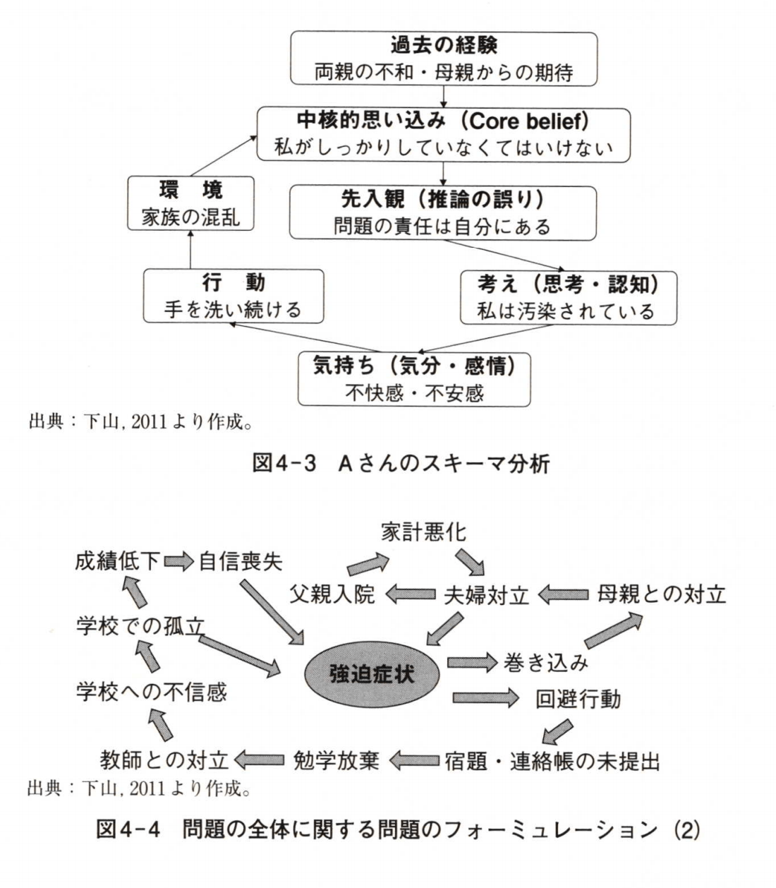
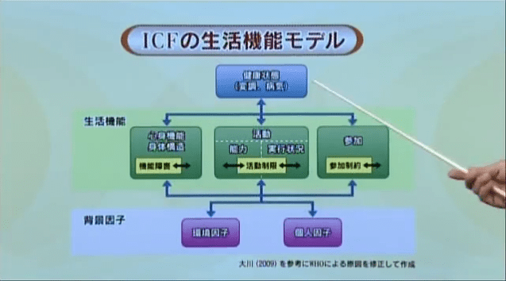
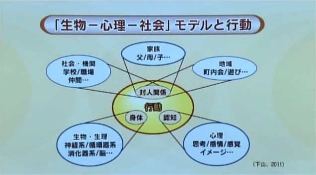
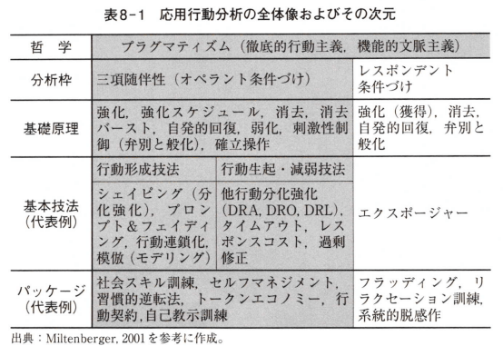

# 認知行動療法

## 1. 認知行動療法とは何か

### 1-1. 認知行動療法を学ぶために
- 認知行動療法(CBT)
  - 2つの異なる系譜
    - 行動療法
    - 認知療法
  - 第三の波
    - 文脈主義
    - 大正時代の **森田療法** と非常に近い
      - あるがまま
- 認知行動療法を学ぶに当たっては、まずそれぞれ異なる立場や技法を含みつつ、全体としてどのように構成されているのかについて知っておくことが必要になる(下山 2011)

### 1-2. 認知行動療法における問題理解の原則
- 学習の原理
  - 学習：刺激に対する反応のなかで新たな行動を習得していく活動
    - 認知行動療法はこの学習の原理に基づいて構成されている
    - 行動療法は学習に関する研究の方法や結果や理論の臨床応用(山上・下山 2010)
    - 認知療法は情報処理に基づくもの
      - 不適切に学習してしまった非機能的な認知を機能的認知に置き換えることを目標
      - より適切な認知の学習を支援する方法
  - 学習は刺激-反応の図式においてなされるもの
    - さらに反応の結果としてどのようなことが起きるのかによって反応の機能や意味が変わってくる
    - 快であれば反応が強化、維持される
    - 不快であれば消去される
  - したがって、人間の反応は刺激(Stimulus) - 反応(Response) - 結果(Consequence)の3項随伴性図式の中で維持されたり中止されたりすることになる
- 統合システムとしての問題理解
  - 認知行動療法は現在の生活場面という環境の中で起きている問題の解決を目指す。
    - 問題を人と環境から構成されるシステム間の相互作用とみなす。
    - さらに、人の反応システムの構成要素が内部で相互作用を起こして反応が決定されるとみなす。
      - 認知・思考
      - 感情・情動
      - 行動・動作
      - 生理・身体
    - したがって、下記のような統合システムが形成されている。
      - 環境から人への刺激
      - その刺激を受けて人の内部の構成要素の相互作用が生じて反応が決定
      - それが反応結果として環境に戻っていく
    - 環境と各要素の相互作用を含む統合システムが問題を維持する悪循環を形成していると考える。
      - 環境: 物理的環境だけでなく、社会的、家族的、文化的、経済的環境も含む
    - 統合システム原則が認知行動療法のアセスメントの基本的枠組み
      - 統合システムに介入し、悪循環を止め、それとは異なる適応的なプロセスに転化していくことが介入の目標
- 現実に起きている問題の重視
  - 認知行動療法では標的(ターゲット)とする問題行動を変化させることは、それと関わっている他の問題、さらにはその人の生き方そのものの変化にも繋がると考える
    - 統合システムの悪循環の回路の中で相互に関連している
    - 一部が変化すれば他もそれに連動して変化する
  - したがって、認知行動療法は問題の要因となっていると想定される過去の体験ではなく、今ここで起きている現実の問題を介入のターゲットとすることを原則とする。
    - 過去の経験を全く扱わないというわけではない。
    - 過去の経験を含めて現在の問題を理解するのが問題理解の仕方

### 1-3. 認知行動療法における介入の原則
- 問題解決の原則
  - 認知行動療法では日常生活で生じている問題行動を本人が生活するのに適した行動に改善することを通して問題解決の支援をする
    - 面接場面での介入だけでなく、日常場面での取り組みが介入の前提となる。
    - 日常場面で実施する課題(ホームワーク)が出され、実際の生活の中で行動の改善を図ることが求められる。
  - クライエント自身が問題解決に積極的に関わっていくことが目指される
    - セラピストはあくまでもクライエントの主体的な取り組みを支援する立場をとることになる
  - セラピストはなぜに問題が維持されてしまっているのかに関する仮説を立てる
    - それが問題のフォーミュレーションとなる
    - セラピストはその仮説の妥当性をクライエントと一緒に検討した上で、その問題のフォーミュレーションをクライエントにわかりやすく説明し、クライエントの同意を得て問題解決に取り組む
  - 心理教育: 問題のフォーミュレーションをクライエントに説明する作業
- 心理教育と協働関係の重視
  - 認知行動療法においては、心理教育を通してクライエントとの間で協働関係を形成し、動機づけを高めることが問題解決の前提となる
    - 介入の最終目標: セラピストの支援がなくても日常生活において生じる問題を自ら処理できるようになること
    - クライエントが自らのセラピストになることが目指される
  - 具体的な問題の解決をクライエント自身ができるようになり、それが他の問題にも汎化していくことが介入の基本前提となる
    - その点では長期の介入を前提としない。
    - 時間制限法が介入枠組みとなる
      - 原則として介入期間を限定し、その期限内でセラピストとクライエントが共同して集中的に解決を目指す
- 仮説-検証の原則
  - 臨床過程では問題のフォーミュレーションに基づいて介入方針を立てる
    - ケース・フォーミュレーション: 問題のフォーミュレーションに介入方針を加えたもの
    - 実際の介入段階に入る前に、そのケース・フォーミュレーションの妥当性をクライエントとの間で検討する
  - 合意が成立したならば介入
    - 一定期間介入を行った後にその効果を測定し、ケース・フォーミュレーションの妥当性を検証する
      - 妥当性の検討にあたってはクライエントの行動観察や自己評価式尺度なども用いられる。
      - 変化を数量化し、客観的に効果を測定する
      - 効果がみられない場合には、ケース・フォーミュレーションを変更し、より効果的な介入を目指す。
  - このように認知行動療法の臨床過程はデータに基づいて仮説生成-検証過程を繰り返す仮説-検証の過程になっている
- 実証性の原則
  - 認知行動療法では単なる臨床的逸話ではなく科学的な証拠(エビデンス)において有効性が確認された方法を優先的に用いることが求められる
    - 有効性については、効果研究によって検証されたもの
      - 1970年代~ エビデンスベイスド・アプローチ
        - ランダムか臨床試験(RCT)
        - メタ分析
      - 実証的に有効性が検証された方法を用いることが推奨
    - 認知行動療法は積極的に効果研究を行い、多くの障害に関して有効性が確認された。
      - 特定の障害に対して有効な技法を開発する研究活動も進められてきた
        - 数多くの障害に対して認知行動療法の有効性が認められるようになっている
          - e.g. 国営医療サービス(National Health Service)で採用する治療法のガイドラインを提示している政府機関であるイギリスのNICE(National Institute for Clinical Excellence)
            - 統合失調症、うつ病、摂食障害、全般性不安障害、パニック障害、PTSDの治療に対して認知行動療法を推奨
          - e.g. 米国心理学界"strongly research support"とされた介入法のリスト

### 1-4. 第1世代の認知行動療法: 行動療法の系譜
- 行動理論: 1910年代には **行動主義** として心理学の中心的理論となっていた。
  - 1950年代 J.ウォルピ: パブロフの古典的条件づけを拡張し、系統的脱感作の手続きを開発(**新行動S-R仲介理論** に基づく)
    - 恐怖を喚起する刺激と拮抗する反応(リラックス)に注目し、恐怖刺激を総裁し、抑制できるようにした
    - 現在では段階的曝露(エクスポージャー)法として臨床実践で広く用いられるようになっている
  - 1950年代 **応用行動分析理論** が発展
    - B.F.スキナー: オペラント条件づけを提唱
      - 先行する出来事(先行刺激: Stimulus)と結果(強化: Consequence)を変化させることで反応(Response)に変化をもたらすことができる
      - 強化法や消去法、刺激統制法として臨床応用、トークンエコノミー法、SSTなどに発展
  - 1960年代 行動主義の新たな次元の発展として社会学習理論が唱えられるようになった
    - A.バンデューラ: **社会学習理論** によって、認知プロセスが行動の媒介機能となっていることを指摘
      - 刺激と反応の間にある認知の仲介機能に焦点
      - 学習は他者を観察することによっても成立する
      - モデリングやセルフモニタリング、あるいは自己観察、自己評価、自己強化に基づく自己コントロールのモデルが提案されるようになった
    - D.マイケンバウム: 自己教示訓練法を発展させた
      - 行動の多くは思考や内言(internal speech)によってコントロールされており、その思考や内言に関連する自己教示を変化させることで、適切な自己コントロールの技法が開発された。

### 1-5. 第2世代の認知行動療法: 認知療法の系譜
- 認知療法は元は **精神分析** を学んだ人々によって1970年代に新たに提唱されるようになった
  - A.エリス: **論理情動療法**
    - 感情と行動は出来事それ自体によって喚起されるのではなく、その出来事をどのように解釈するのか、つまり認知のあり方によって変化する
    - ABC理論: 出来事(A: Activating Event)は信念(B: Belief)に照らして判断され、結果として感情や行動(C: Consequence)が喚起される
    - 信念には合理的なものも非合理的なものもある
      - 不適切な感情や行動は非合理的信念(irrational belief)によって引き起こされ、持続する傾向があるとするABCモデルが提案された
  - A.T.ベック: **認知再構成法**
    - 自己、世界、将来(認知の3要素)に関する偏った認知が否定的な結果を導くとした
    - そのような認知の根底にあるのが、中核的信念(Core belief)
      - 出来事を判断するよりどころとなる認知的枠組みであるスキーマとして機能する
        - スキーマは乳幼児期からの系ケインによって形成され、意識の底で固定されているとされる
      - 人が不合理な思い込みをスキーマとしていた場合、それが何らかの刺激によって一旦活性化されると、様々な種類の認知的歪みや推論の誤りが引き起こされる。
        - それは自動思考(automatic thought)として現れ、抑うつ気分をはじめとする不適切な感情や行動をもたらす
    - 認知再構成法: 不合理な思い込みを突き止め、認知の歪みを適切な考え方に変えていくことが介入の目的となる(Curwen et al.2000)

### 1-6. 第3世代の認知行動療法
- **マインドフルネス認知療法(Mindfulness-based cognitive therapy)**
  - うつ病の再発における考え込み(rumination)の問題に取り組む過程で、認知療法の有効性は否定的認知の内容を変化させることよりも、むしろ自らの考え方から距離を取り、脱中心化することにあるとのJ.D.ティーズデールら(Teasdale et al. 1995)の見解に基づくもの
  - 不適切な思考の変化を強調せず、非判断的で、受容的な注意の配り方を習得できるように援助するものとなっている。
  - クライエントがメタ認知を獲得し、それらを新たな仕方で関連づけるように支援することで、習慣的となって凝り固まっていた不適切な認知からクライエントが自由になることが目指される。
- **アクセプタンス&コミットメント・セラピー(弁証法的行動療法, ACT: Acceptance & Commitment Therapy)**
  - 問題は行動の柔軟性と効率性の欠如によるものとみなす
  - クライエントが固定した認知や感情に邪魔されたとしても、有用な行動を選択できるように支援することを目標
  - 関係フレーム理論: 問題を心理的な柔軟性欠如と経験回避の反映とみなす
  - 2つの過程のバランスを取る
    - アクセプタンスとマインドフルネスの過程
    - コミットメントと行動変化の過程
  - 豊かな経験をもたらす心理的柔軟性と状況に応じて選択した価値に従った行動を取ることが目指される。
- これらの新しい方法
  - 文脈や機能という特製の重要性
  - 東洋的な瞑想法
  - 禅の思想や森田療法など日本の文化や思想とも通じるもの

### 1-7. まとめ
- 認知行動療法には第1〜3世代といった理論的展開過程がある
  - それぞれの世代で基本的な考え方も異なっている面もある。
  - いずれの世代においても共通する特徴があり、共通する介入プロセスがある。
- 認知行動療法に特徴的な介入プロセス(Westbrook et al. 2011)
  - アセスメント段階
    - 対象となる問題を特定し、刺激-反応図式に基づき、その問題を維持している悪循環を見出す
    - 悪循環を見出す際には、刺激に対して認知、行動、身体、感情といった要素が相互に関連して問題を維持させているプロセスに着目、それを問題のフォーミュレーションとして定式化する
  - 心理教育段階
    - 仮説としてフォーミュレーションを説明し、意見を聞き、修正をし、合意していく過程においてクライエントとの間で協働関係を形成する
  - 介入段階
    - 問題のフォーミュレーションに基づき、介入方針を話し合い、合意した上で介入を行う
    - 介入方針は有効性が実証されている技法を優先的に採用する
    - 介入にあたっては、問題の改善に向けての方法を話し合い、それを次回のセッションまでに日常生活において試験的に実践してくるための宿題を出す。
    - セッションでは宿題の成果を検討し、有効性が認められない場合には介入方針の修正を行う

## 2. 認知行動療法を支える原理とその活かし方

### 2-1. 認知行動療法のつかみどころのなさについて
- 心の働きの変化のための常識的原理が土台になっている
  - 基礎から臨床までの膨大な実証研究によって支えられている
- ニーズに応えて、つぎたしと結合で大きな体系となった
  - つぎたしは響きが悪いが、人間の脳もそのような進化をとげてきたという見方もある(Marcus 2008)
- 絶対的な創始者がいない
  - 自由に進化発展
  - どちらかといえば米国流プラグマティズム
- ある特定の病理についての仮説から誕生した理論技法ではない
  - 大抵のサイコセラピー理論では大きな病理仮説を持っている

### 2-2. 根本原因を確実につかんだうえで援助を進めるわけではない
- 認知行動療法は生活向上に貢献する
  - 心の問題の背後にある根本原因を掴むということを認知行動療法は目指さない
  - 医学的なモデル
    - 感染症治療モデル
      - 症状←根本原因←根本治療
      - 発熱←ウイルス←ワクチン
      - 行動障害←愛情不足？無意識←？？？ (心の場合)
    - 生活習慣病治療モデル
      - 高血圧
        - 本人理解・動機づけ・食事・生活リズム・測定
        - 組み合わせて多面的に進める
      - 認知行動療法モデルはこれに近い
- 本人が改善のために尽力することを前提とする
  - セルフコントロールでQoL維持が目的
- セラピストはコーチやトレーナーというスタンス

### 2-3. 《変化の常識》その1: 直後の快や安堵に影響される
- 強化刺激
- ある反応表出がその場において本人自身に役に立つことを **機能する(functional)** と表現する

### 2-4. 「望ましい」を増やすと「望ましくない」を減らすは表裏一体
- 刺激と反応の連鎖
- 自然回復を舞台裏から支援するのが認知行動療法
  - 活動性が高まり、それにともなって快も得られやすく成り、うつが軽くなる。さらに活動性が高まる‥という循環のパターン

### 2-5. 《変化の常識》その2: ふるまいや考えの直前には手がかりがある
- 刺激性制御(stimulus control)
  - 環境調整

### 2-6. 《変化の常識》その3: ふるまいや考え方を自分で確認するとそこに変化が生じる
- モニター
  - 内省は変化の第一歩となり、変化を起こしやすくする
- 認知行動療法は意識と無意識をとりたてて区別しない

### 2-7. 《変化の常識》その4: 考え方もモニターしチェックすることで変化していく
- 表に出にくい感情や考え方、思い込み、解釈などまでもモニターする
  - 色々な場面で情緒的にコントロールしにくい習慣をセルフコントロールしやすくするという
- 振る舞いは外側から観察できるが、考え方やモノの捉え方、思い込みは他人が外からというわけにはいかない
  - 推測で決めつけるのは関係悪化のもと
- 「心が病むのはその人の受け止め方次第」
  - 正論と言えば正論だが、この原理にばかり頼らないことも大切
  - シンプルなメッセージなので、それだけに認知行動療法の中でもかなり専門的な技術が必要に成る
  - 適用しやすい対象に丁寧に進めれば確実に成果があがる方法であることは実証されている

### 2-8. 《変化の常識》その5: 人のふり見て
- モデリング・観察学習
  - ミラー・ニューロン
  - 誰かの振る舞いを観察するだけで反復訓練をしているのに近い効果がある
- **SST(社会的スキル訓練)**
  - 何らかの理由から取りたくても取れない行為も、誰かのパフォーマンスがあれば、それを観察するだけで取りやすくなる

### 2-9. 《変化の常識》その6: 衝動とともに過ごす術を体得する
- **エクスポージャー**
  - 衝動と付き合う
  - 計画的に反復すれば衝動との付き合い方がうまくなる
  - 衝動を上手にかわす方法をより洗練していくアプローチも一つの進め方だが、エクスポージャーでは症状も改善して再発もしにくいことがわかってきた
    - 本人の選択次第
  - 依存症にも応用

### 2-10. まとめ
- 特性や特徴に応じた実践がある
- 心理教育
  - クライエント本人とその身近な支援者への説明

## 3. 認知行動療法のプロセス(1) — 関係性構築と面接技術の基礎

### 3-1. はじめに
- 面接時の関係性構築や面接技術
- 認知行動療法が効果的であるためにはクライエントとの関係性の構築は極めて重要

### 3-2. 関係性の重要さ
- セラピストとクライエントの関係性の構築

### 3-2-1. ランバートの円グラフ
- **ランバートの円グラフ**(Asay & Lambert 1999)
  - クライエントの改善に寄与した要因を推定
    - セラピストとクライエントとの関係性が最も効果的に寄与するもの(約30%)
    - 心理療法の各学派のアプローチ(技法)の違いは全体の約15%
  - セラピーを経て生じるクライエントの変化にはセラピストとクライエントの関係性が重要
  - 各学派のアプローチの違いによってある程度の効果の差がみられるという事実
    - これまでの効果研究
      - 異なるセラピーの間に有意な差がある
      - 一般的には認知行動療法は成績がよく、最もエビデンスが支持されるものである(e.g., Roth & Fonagy 2005)

#### 3-2-2. 認知行動療法における関係性: 認知行動療法では関係性をどのように位置づけてきたか
- 認知行動療法では関係性自体がクライエントの変化の十分条件とは考えていない
  - セラピーの効果を高める上で極めて重要な要素であると当初から位置づけている
  - 主要な心理療法と同じく、誠実さや温かさ、肯定的配慮、的確な共感を大切にしてきた(Beck et al. 1979)
- **協同実証主義**
  - セラピストとクライエントが協同的な立場でタッグを組み、それぞれがセラピーに積極的に関わりながら実証的にクライエントの状況を理解し、クライエントにとって役立つ行動や認知のレパートリーを試しながら、症状の緩和や問題の解決を試みる

#### 3-2-3. 認知行動療法における関係性の影響: 関係性についてのエビデンスは？
- 認知行動療法における改善の度合いはセラピストとクライエントとのあいだの「治療同盟」の確立の度合いと強く相関している(Krupnick et al. 1996)
- クライエントが認知行動療法を受けて援助的だと感じたポイントを調査したこれまでの研究では、一貫して各技法以上にセラピストとの関係性自体が助けになったと評価されている(e.g., Ryan & Gizynski 1971)
- 様々なセラピーに共通する要因(話を聞いてもらうなど)と認知療法に固有な要因(思考記録をつける、自分の中核的信念を書き出すなど)の双方がクライエントにとって有用であった(Clarke et al. 2044)
- クライエントの動機づけが高く、クライエント自身が介入に積極的に参加することも介入効果を予測することが示されている(Kazantzis, Whittington & Dattilio 2010)

### 3-3. 関係性構築するための面接技術: どうすれば援助的な関係性が築けるのか
- 効果的な作業同盟構築のためにセラピストに求められる指針(e.g., Raue & Goldftied 1994)
  - クライエントが自身の問題を理解できるよう援助できること
  - クライエントが苦しめられている状況がどのようなものであっても、それに向き合っていくようにクライエントを励ましていけること
  - クライエントへの理解を示しながら話をすすめていけること
- こうした指針を実施する際に必要となる面接技術は認知行動療法の学習過程で詳述されることは少ない
  - こうした面接技術は認知行動療法を学ぶ前に習得しておくべき基礎的な必須技術として位置づけられている

#### 3-3-1. クライエント中心療法の基本原則(共感的理解の大切さ)
- C.R.ロジャーズ
  - 共感(的理解)
  - 自己一致
  - 無条件の肯定的関心(配慮)
- 共感
  - 「セラピストがクライアントの私的な知覚の世界に入っていく能力」であり「瞬間瞬間に、クライエントの内面に流れていて絶えず変化している、感じられた意味に敏感であること」と定義(Rogers 1980)
  - これまでの効果研究では共感の程度がセラピーの結果に影響しているというエビデンスがある(Miller et al. 1980)
  - 関係性構築を主な手段とするセラピー以上に認知行動療法では共感とセラピー効果との関係性がより強く示されることが報告されている(Bohart et al. 2002)
- 知的な理解にとどまらず、クライエントの体験している世界をクライエントの見方から見るように共感的に理解する
  - 山上敏子(2001)の行動量の記述
    - 体験として問題を把握、体験を支えて、体験をもたらすことで治療を行う

#### 3-3-2. 関係性を構築するための面接技術(マイクロカウンセリングを題材として)
- 共感的理解に基づいたクライエントとの関係性構築のためにどのような面接技術を有することが必要か
  - 様々なカウンセリングの訓練モデルによって提唱されており、そのエビデンスも支持されている
- マイクロカウンセリング(A.アイビー, Ivey, A.)
  - カウンセリングで用いるコミュニケーションスキルを3段階でまとめている(福原他 2004)
    - 傾聴技法: クライエントにかかわり、わかろうとする際に用いる
    - 積極技法: クライエントをリードする際に用いる
    - 統合技法: 傾聴技法と積極技法を適切に用いるため
  - 傾聴技法がクライエントと"ともにある"ために有益な面接技術であり、関係性構築の基本技術
    - かかわり行動
      - 傾聴の基礎
      - クライエントの会話を促す機能を有する非言語的・言語的なカウンセラーの態度(かかわり方)
      - ４つの指標に着目がなされる
        - 視線の合わせ方
          - 「セラピストが自分の話を聴いてくれている」と実感できるサインのひとつ
          - 必ずしも直視がよいとは限らない。個人に合わせて配慮する。適度に合わせる。
        - 声の質
          - クライエントに対する関心や配慮をあらわすもの
          - 声の調子や話す速さが適切なものかを留意
        - 言語的追跡
          - クライエントがが伝えようとしている話題をよく聴き、それに寄り添うこと
          - 話題を変えずに寄り添う態度
        - 身体言語
          - セラピストの態度や表情からクライエントに伝わるメッセージ
          - 一般的に面接時はセラピストは自然でリラックスした姿勢や態度
          - 積極的に耳を傾けるときの体勢や表情
          - e.g. 少し前かがみになる→自分に関心を持っているというメッセージ
    - クライエント観察技法
      - クライエントの非言語的行動と言語的行動に着目する技術
    - 質問
      - 質問には開かれた質問、閉ざされた質問がある
        - 閉ざされた質問
          - はい、いいえ、想定される答えから選択させる形でのひとことで答えられる質問
          - 特定の情報の確認、客観的なことを話し合う際にも用いやすい
          - 質問のピントがずれている場合には栗園とが話したい内容を話せない
        - 開かれた質問: ひとことでは答えられない質問
          - クライエントがそれぞれの状況でどのように考えたり、感じたりしているのかを理解していくために有益
          - 前回のセッションで話したことを要約し、それに焦点をあてたうえで部分的に開かれた質問を用いることもある
          - セラピストが欲しい情報を入手できないことがある
    - はげまし、いいかえ、要約
      - 共感的理解を促し、理解した内容をクライエントに伝え返して、それを伝え返し、明確化していくために用いられる
      - はげまし
        - クライエントが話を続けやすくするためのサインの機能を持つ応答技術
        - 言語的なものと非言語的なものがある
        - うなずき、短いフレーズ「ふんふん」「そうでしたか」、クライエントが使った言葉やキーワードの繰り返し
      - いいかえ
        - クライエントが話したことの要点をセラピストの言葉を用いてクライエントにフィードバックする応答技術
        - セラピストの理解の正確性をクライエントに確認することができる。
      - 要約
        - 比較的長いスパンにおけるポイントを要約して明確化する応答技術
        - 整理統合できる点で役立つ
        - 適切な要約は共有した内容を踏まえて新しいトピックへの移行の節目になる
    - 感情の反映
      - クライエントによって言語的もしくは非言語的に表現される感情を汲み取り、もしくは推測し、それをクライエントに伝え返す応答技術
      - 自分の感情が的確に言語化されるとクライエントは自分の気持ちがわかってもらえたと感じる
      - この技術を用いるためには蔵エイントが言語化している表面上の感情に注意するだけでは不十分
        - まだ表現できていない(されていない)感情に着目する
        - 非言語的に表現された感情や感情表現に置ける言語と非言語間のズレ(矛盾)なども重要な情報源

#### 3-3-3. 動機づけ面接法(クライエントの変化に対する理解・配慮・対応)
- 動機づけ面接: アンビバレントな葛藤を抱えるクライエントに働きかけ、本人が本当に望む方向性に進むことができるように動機づけるためのアプローチ
- クライエント中心療法の発想をもちつつも、エビデンスの支持された認知行動的介入の一種にも分類される面接技術とされており、変化への葛藤をかかえるクライエントの面接初期における動機づけ、および協働関係の構築に重要となる(Miller & Rollnick, 2002)
- ４つの原則
  - 共感を示す
    - セラピストはクライエントを正確に理解し、その内容を伝え返していくように努める
  - 矛盾を拡大する
    - ギャップが認識されれば行動変容は起こりやすくなる。
  - 抵抗に巻き込まれ、転がりながら進む
    - 「行動を変えることに対して両価的(アンビバレント)になるのはもっともである」という理解を持ち、クライエントと接する
    - 行動変容を無理に進めたり、変化しないことの悪影響についてただ直面させると、クライエントは「どうして変わることができないのか(難しいのか)」を説明することになる
      - これは本来望む方向の行動変容とは逆の立場が強化されることになる
      - 間違い指摘反射
        - 一方的な説得、教育、指示、アドバイス
        - クライエントをよくしたい、良い方向に変化させたいと思うセラピストが陥りやすい罠
  - 自己効力感を支える
    - 行動変容に向けてクライエントができたことや試みたことを強化していく
- ４つのプロセス
  - 「かかわる」段階
    - クライエントと信頼関係に基づく作業同盟を構築することが重視される
    - 重要となる面接技術: 開かれた質問、聞き返し、是認、要約
      - 是認: 変化につながる発言や見方に気づき、認め、それを促していく面接技術
      - 聞き返し: クライエントが述べたことに対して言葉を選んで応答する技術
  - 「フォーカスする」段階
    - クライエントが進みたいと思う方向を模索し、ゴールを共有することが重視される
    - 重要となる面接技術: 開かれた質問、聞き返し、是認、要約
  - 「引き出す」段階
    - クライエントが進みたいと思うゴールに向けて、クライエントの動機づけを引き出すようなかかわりあいが重視される
    - 重要となる面接技術: 開かれた質問、聞き返し、是認、要約、チェインジトーク
      - チェインジトーク: 本人が望む目標への変化につながる発言
  - 「計画する」段階
    - クライエントにおける変化のターゲットを設定し、変化のための選択肢を検討し、計画する
    - クライエントの変化への自信を支え、コミットメント(実行しようとする意思表示)を引き出していく
    - 重要となる面接技術: これまで用いられてきたものに加え、情報提供やアドバイスをする技術、コミットメント言語に気づき、引き出し、適切に応答する技術
      - コミットメント言語: 「したい」「できると思う」「するつもりです」などの本人の動きにつながるチェインジトーク

### 3-4. まとめ
- セラピスト自らの面接に関する認知や行動(非言語的・言語的な面接時の言動)をモニターしながら面接行動のレパートリーを増やしておく

## 4. 認知行動療法のプロセス(2) — ケース・フォーミュレーション

### 4-1. 問題の成り立ちに関する仮説としての問題のフォーミュレーション
- アセスメントで得られる情報はただ網羅されていただけでは介入方針を立てるのには役立たない
  - 多様な要素と関わる情報を系統的に収集
  - それらを統合して問題の成り立ちを明確化
  - 個々の事例に適した介入法を組み立てていく作業が必要
- ケース・フォーミュレーション
  - 問題のフォーミューレーション＋介入方針＝ケース・フォーミュレーション
    - 問題のフォーミュレーション：「事例の当事者の心理的、対人的、行動的問題の原因、促進要因、およびそれを維持させている力に関する仮説であり、その人に関する複雑で矛盾した情報をまとめ上げる助けになるもの」T.D.エルズ(Elles 1997)
  - 精神医学における病気の診断とは異なり、問題についての臨床的見解を作成することを目的とする

### 4-2. 第1段階: ターゲットとする問題を特定する
- ターゲット決定のポイント
  - 具体的な行動をターゲットとする
  - 本人が変えたいと望むものを優先する
  - 変化を客観的に観察しやすい行動を優先する
  - 変化が起きやすい行動を優先する
- クライエントに現在経験している問題について自分のことばで説明するように求める
  - クライエント自身の見方が問われる
  - セラピストはクライエントが問題を特定化し、それを具体的に説明できるように援助する
    - e.g. クライエント「生きていても意味がない」
      - あなたにとって具体的にどういうことか、どのように意味がないのか、そのように考えることは将来の希望や目標にどのような影響を与えるか
      - 「生きていても意味がない」という表現がどのような事態を示しているのかを具体的に明らかにしていく
- 具体的に特定化された問題→介入の標的(ターゲット)となる
  - 目標が明確であればあるほど、クライエントにとっても介入の目的を理解しやすい&その目標を達成できる可能性が高い
  - 問題が具体的であれば、その変化を具体的に評価することも可能

### 4-3. 第2段階: 問題を維持している悪循環を明らかにする
- 次にその問題を維持させているプロセスを明らかにし、問題のフォーミュレーションを形成していく作業に入る
- **機能分析**
  - 行動療法系のケース・フォーミュレーションで重視される技法
  - 心理的問題を引き起こす要因となっている変数を特定する方法
  - 3点の情報を収集する
    - 問題を引き起こす刺激
    - 刺激に対するクライエントの反応＝不適切な行動
    - その反応から引き起こされる結果
  - 前提：不適切な行動はそれを引き起こす刺激とその後の結果から切り離すことはできない
    - 刺激-反応-結果(S-R-C)で示される随伴性が問題行動を形成し維持しているプロセスを構成しているとみなす
  - M.ブルックとF.W.ボンド：3次元反応分析(Bruch & Bond 1998)
    - 言語的-認知的次元
    - 生理的-身体的次元
    - 行為的-動作的次元
  - 機能分析のためのデータは面接によって得られる認知関連の情報だけでなく、標的行動を引き起こす刺激にクライエントが実際に直面している場面を観察して行為や整理に関連するデータを収集することも必要
    - 構成要素がはっきりしなかったり複雑な場合は観察は特に有効
  - 問題を維持しているプロセスがある程度明らかになった後に介入の標的となる問題行動の発展経過の情報を収集
    - 専門家への相談歴や治療歴があるか、あるとすればどのような内容であったのかということが含まれる
    - 「問題の発生」と「問題の発展」を区別することに注意
      - 問題の発生：問題がどのような事情で開始したのか、どのような事情と関連しているか
        - e.g. 「児童期に発達障害と診断され、タイ人場面のコミュニケーションが苦手であり、それが原因でいじめを受け、それ以来抑うつ気分が生じるようになった」
      - 問題の発展：クライエント、配偶者や家族といった関係者が現在起きている問題の形成経過をどのようにみているのか
        - e.g. 「不登校になり、家にひきこもってから、さらにうつ状態が悪化しました」
  - 機能分析は行動理論における応用行動分析や機能的アセスメントと重なっている
    - 機能分析という語→問題行動が生起しているコンテクストに位置づける→問題行動が果たしている機能的役割に注目
    - 問題行動が生起しているコンテクストにおいては問題行動を維持・悪化させている悪循環が起きている
    - クライエント個人だけでなく家族、様々な社会状況のレベルを含めて悪循環のプロセスを明らかにしていくのが機能分析
- **スキーマ分析**
  - 認知療法系のケース・フォーミュレーションで重視される技法
  - スキーマ(schema)：心的活動を行う際の抽象的な見取り図のようなもの
    - 情報を想起したり解釈したりするための構造
    - 問題解決のために構築された枠組み
    - その人の情報処理や行動を導く役割
    - 乳幼児期から形成され始める
  - その人が自己・他者・世界についてどのように考え、感じ、振る舞うかを決定する
    - このようなスキーマは階層構造を成している
    - 根底に不安を喚起するような信念を持つ人は様々状況において不安が喚起されやすい
  - **中核的思い込み(信念)**
    - 認知行動療法はスキーマ体系の根底にある信念を認知モデルの中核に据えている
    - 階層構造の根本にあるがゆえに、その人の人生の大部分に影響を与えることになる
    - 融通性がなく、内容を頑固に変えないまま幅広く、しかも過剰に一般化されやすい
  - したがって、認知行動療法では中核的思い込みを含むスキーマの変更を介入の根本原理とする(Curwen et al. 2000)
  - **認知の概念化**
    - クライエントの先入観(認知の偏り)や中核的思い込みを明らかにしていく
    - 機能分析との関連では、言語的-認知的次元に特化した問題のフォーミュレーション
  - **認知の再体制化**
    - 先入観や中核的思い込みの変化を促す介入

### 4-4. 第3段階: フォーミュレーションの妥当性を検討する

- 問題のフォーミュレーションはあくまでも問題の成り立ちに関する仮説
  - その妥当性を検討する
  - 仮説検証は**臨床実験**と呼ばれる方法によって行われる
    - e.g. "問題行動を引き起こす刺激", "問題と鳴っている反応行動", "行動の結果"の現れ方やその頻度を記録して、想定したプロセスが実際に起きているのかを確認する
    - e.g. クライエントがある特定状況において思い浮かぶ考え方を記録し、それが不適切な行動を維持させている要因になっているのかを検証する
    - e.g. セラピストや関係者がクライエントの行動を直接モニターする
      - クライエントの不安が非常に強く、本人が自らの反応や考えを正確に記録できない時に有効
- 問題の成り立ちに関する仮説の妥当性が確信された場合
  - セラピストはそのフォーミュレーションに基いて介入の方法を計画し、実施していく
- 仮説が不確かな場合は問題のフォーミュレーションを修正

### 4-5. 第4-5段階: フォーミュレーションに基いて介入し、効果を評価する

- 問題のフォーミュレーションに基づき介入目標を明らかにする
  - e.g. 特定の思い込みが不適切な行動を維持する要因となっているとの仮説
    - 介入目標「クライエントがその思い込みに変わる新たな考えを持てるようになること」→クライエントに説明
    - クライエントが納得→クライエント自身の理解に基づいて具体的な目標を設定
      - 例えばセラピストは「新たな考えはロールプレイを繰り返すことで学習できる」としてその介入プログラムを提案
    - クライエントが合意→具体的目標のタッセを目指して介入を実施
      - 介入技法は目標に応じて選択
      - 介入技法の選択は3次元の反応分析の結果が参考となる
        - 刺激状況: 刺激コントロール、危機介入、コンサルテーション、家族療法、親訓練
        - 言語的-認知的次元: 自己教示訓練法、思考妨害方、読書療法、認知再構成、イメージ技法、心理教育
        - 生理的- 身体的次元(感情次元を含む): 薬物療法、バイオフィードバック、リラクセーション、自律訓練法、呼吸法、フォーカシング、催眠法、エクスポージャー、不安/怒りのマネジメント法
        - 行為的-動作的次元: セルフモニタリング、モデリング、ロールプレイ、行動リハーサル、トークンエコノミー、系統的脱感作法、反応妨害法、ソーシャル・スキルトレーニング、アサーション・トレーニング
- 介入効果の評価→妥当性と信頼性のある尺度を用いて、どのような変化が生じたのかを確認することが理想的
  - しかし、実際の臨床場面で研究として厳密な評価をすることは不可能であるし、倫理的に適切とは言えない
  - セラピストはクライエントに悪影響を及ぼさないような形で介入効果の評価を行うことが望ましい
    - e.g. 強迫性障害に苦しむクライエントへの介入
      - 脅迫的反応の頻度と継続期間を記録するという手続きを活用するのでもよい
      - その結果に基づきクライエントと有効性について話し合い、必要に応じて介入法の修正を加える

### 4-6. 問題のフォーミュレーションの実際

- 想定事例(下山 2008)

### 4-7. まとめ

- 第1段階: 問題の当事者・関係者から問題の情報を得て問題を特定化、協働関係を形成
- 第2段階: 問題を生じさせている要因と、その問題を維持させている要因、それらの要因が重なり合って成立している統合システム(悪循環)を仮説として明らかにする
- 第3段階: 仮説の妥当性を検討し、問題のフォーミュレーションを完成させ、介入方針を立てる。
- 第4段階: 介入を開始、結果をモニター
- 第5段階: 介入効果を測定、評価し、その結果に基づき、必要に応じてケース・フォーミュレーションを修正する。最終的にはこの介入効果の評価とケース・フォーミュレーションの修正を繰り返してより効果的な介入を発展させていく。

## 5. 認知行動療法の基本技法(1) — セルフモニターと行動活性化

### 5-1. 認知行動療法におけるクライエントとセラピストの関係

- **協働実証主義(collaborative empiricism)**
  - 認知行動療法に特徴的なクライエント-セラピスト間の望ましい関係のあり方
  - コンサルテーションの関係性でもあるといえる
    - クライエント→個別的事情をよく知っている専門家
    - セラピスト→一般的な対処法についての専門家
    - 認知行動療法は、認知行動療法とその導入についての専門性をもつセラピストによる、「症状、問題の具体的な状況や事情、体験について最も詳しく、かつその管理に責任がある」クライエントに対するコンサルテーションである。
- 臨床心理学や精神医学は病理モデル→セラピストがクライエントに対して優位に立つ関係になりがち
- クライエントの世界観にセラピストがすっかり入り込む→セラピストが振り回される関係になりやすい。
- 協働実証主義の関係ができている→クライエント本人も自らの問題を対象化(外在化)しやすくなる
  - 今付きまとわれてしまっている困難さに対してどう手が打てるかがテーマ
  - クライエント自身が問題ではないし、クライエントの人間性の奥深くに病理が巣くっているわけでもない
- 問題の症状の外在化
  - ブリーフサイコセラピーにおいて重視されている技術
  - 抑うつ、躁鬱などの気分の問題では、クライエント本人がどれだけ対象化できるかに改善しやすさが大きく左右される

### 5-2. 何をどうセルフモニターしてもらうか

- 実践しやすい課題から取り組むのは認知行動療法の定石
- セルフモニター→低負担なものから
  - 変容が望まれかつ具体的にとらえやすい行動
  - その行動の結果をシンプルに数値で測定
- 記録によって「問題、困り」への意識が高まる
  - 意識の変化からさらなる継続的な変化のためのヒントが得られる
  - このような展開そのものが認知行動療法
- うつのセルモニタリング
  - うつは気分の障害
    - 気分の変動の記録
  - 起きている時間帯を3~4時間くらいに分割
    - これくらいがセルモニターの第一歩として標準
    - うつ病のクライエントの多くでは起床から夕方くらいまでの抑うつが強く、それ以降就寝までの時間帯は調子がいくらかよくなるという傾向
    - 1日1回全体として気分を評価すると自己のマイナス面に意識が向くうつ病の特徴が影響し一日中悪かったの気分評定になりやすい
  - わずかな変動も反映できる配慮がなされていることが望ましい
    - あり、なしの二分法では毎日ありになってしまう
    - 5段階、できれば0~10の11段階スケールによる評定あたりがよい
    - 筆者は-50から+50までのスケールを使うようにすることが多い
      - 見逃しがちな軽躁(軽い躁の状態)、躁転(特にきっかけもなく躁へ転じて急に活動性が高まること、トラブルの危険)をとらえることができることもある。
  - 心理検査のように比較が目的ではない
    - 自分のためのオリジナルな方法

### 5-3. 気分に加え、関連する出来事やそこでのふるまい、考えも記入する

- 認知行動療法では気分そのものを直接変容させることは難しい
  - 気分や身体の状態へはたとえ本人であっても直接コントロールはできない。
  - 気分や身体の状態＝内なる環境(間接的な変容のみ可能)
- 抑うつ気分につながるふるまいや言語反応、注意の偏りや受け止め方のパターン→気分低下の悪循環の重要な要素として捉える→これら相互の、あるいはこれらの反応と外環境or内環境とのやり取りに変化をもたらす
  - したがって、気分だけではなく、活動の記録、出来事の記録などを気分と対応づけてモニターできるようになると改善につながるヒントが得られやすくなる
  - 活動→特別な活動である必要はない。過ごし方。
- 活動記録表を渡し、特定の時間帯に行った活動を書き込んでもらうことからはじまる
  - セッションのなかで一緒に記入に取り組んでもらい、慣れてもらってから宿題にするくらいの丁寧さが求められる
  - しばしば「昨日は1日なにもしないでだらだらと過ごしました」→実際にはありえない。どうだらだらしてたのかできるだけ記入してもらう
  - セラピストが「記入するに値しない」「活動らしいことはしてないのだろうか」と受け止めてしまうと、クライエントはセラピストの反応を敏感に感じ取ってしまう

### 5-4. セルフモニターへの動機づけについて

- なかなか取り組んでもらえない方もいる
  - 治療への意欲の高さの違いと解釈すべきではない
  - 来談があるということは最低限度の治療への動機づけが存在している
  - 動機づけへの働きかけはセラピストが扱う中でも最も重要な変数
- 「動機づけを高める」よりも「セルフモニターに取り組んでもらいやすくするにはどんな工夫ができるだろうか」といった探究的態度
  - 記録することの重要さを説明しながら話し合う
    - いつ記入するか、どこに記入するか、記録紙はどこに保管しておくべきか
    - モニターした結果を記入する書式を本人の意見や好みを取り入れてアレンジしてはどうか
    - 数値化に使う尺度、数値の意味を確認し、支障があれば本人の直感により合致したものに改変してみてはどうか
- うつ病のクライエントの大半は非活動的な過ごし方の割合が多くなっていることそのものを普段から悲観的に受け止めている
  - 家族や身近な支援者からしばしばそのことを指摘されている
  - そのため、活動へのセルフモニタリングの課題、作業そのものが嫌悪的に感じることも多い
  - 成果が少ないことを反省するのではなく、うつのなかでもこれだけのことができている、ということを確認していくための記録であることを説明
- 集団認知行動療法であれば、互いに似た受け止め方であるとの自覚が得られやすい
- うつ病＝自分の状況を客観的でかつ、公平な視点で見ることができなくなるという、「改善のしにくさ」が誰もが生まれつき身につけている「気分の回復の力」を阻害していることによる障害でもあることを理解してもらえるとよい
- クライエントが「気持ちが重い、身体が重い（＝億劫）」という場合、意志の力を引き出して書き込むことを求めてはいけない
  - 意志の力ではなく自分というロボットの操縦席から、足、利き手それぞれに指示を出すかのような意識により実行しやすくなることもある
- クライエントの「意欲がわかなくて」→「意欲がわかないのですね」
  - マイナス面に焦点をあてるやりとりを、セラピストが共感的な面接だと思いこんで延々と継続するなかから望ましい変化は生まれにくい
- 自殺念慮が高く、一定以上の危険が認められるクライエントには、初期のうちからそれらをモニターの書式のなかに盛り込んでおくのも良い
  - よほど重篤で不安定な時期でない限り、セルフモニターを認知行動療法による介入の基本に据えるべきである
  - モニターすることによる万一のリスクに対して、継続して確認していくことの萌芽、結果的にリスクは抑えられて援助も成功しやすい
  - 自殺に関する念慮でさえも、セルフモニターの対象とすることで、これらの気分や認知との適度な距離がとれるようになってくる
- モニターされた結果について、正確であるほうがよいが、正確さを期すためにあまりにも細かな負担をかけては本末転倒

### 5-5.  行動活性化の発想

- やや極端な言い方になるが、認知行動療法でうつ気分などを直接変容させることはできない
- 直接変化を起こすことができるもの
  - 感覚や感情の状態とつながっている考え方やふるまいのパターン
    - つながっている→因果の判断は不要で、それぞれが影響しあっていることを確認できれば十分
  - 環境側の結果の生じ方
- 良いきっかけが生じやすくする工夫の連続が援助の実際
- 認知行動療法の教科書が「考え方が変われば気分も変わる」という方向性の変容を強調しすぎていることに留意する
  - 期待できる手段の一つだが、このパターンにこだわりすぎると変容の幅を狭めてしまう
  - 考え方や捉え方、スキーマなどの変化が先行することもあれば、それとは異なる新しい振る舞い方や行為、活動が先行した変化によって受け止め方や考え方が変化して気分や意欲が刺激されるという展開も多い

### 5-6. 行動活性化の手続き

- まずクライエントの現在の生活がどのようになっているか
  - 協働実証主義の関係において外在化してながめる
  - クライエントの生活の様子を具体的に映像化してみるとよい
- 「今よりも少し、うつが軽くなってきたら、どんなことができたらいいと思いますか？」などの質問を投げかけてみる
  - あくまで仮想の話であり、やらなければならないことを決定するための質問ではないことを確認する
  - 「うつ状態のなかでもせめて〇〇ができたらいいなあ」を見つけていくためであると理解してもらえるとよい
  - e.g. ドラマがDVD化されているので気になる→レンタル店にでかけてみることができるか、出かける負担を軽くするにはどうできそうか
    - 移動手段、時間帯、それに伴う困難はどう対処できそうか
    - うつの人は些細な出費も気にする状態にあるが、うつを改善する過程では多くの人が「楽しみのための些細な出費」を経験していることなどを伝えるとよい
    - 自転車がよさそうだが、しばらく載ってないのでタイヤの空気が抜けている
      - これは障壁でも抵抗でもなくチャンス
      - まずは空気をいれること、サドルやハンドルの汚れを拭いて、チェーンに潤滑油をさしてみることを活動目標とすることもできる
- 目標行動への誘因を高める会話も有効
  - 過去のことであっても自分のお気に入りについて語ること、それを興味深く聞いてもらえることは誰にとっても快である
  - 快の体験が動機づけを刺激
- 一般的に人が快を得ることにつながる活動についての既成のリストに目を通してもらいながら思いついてもらう方法もある

### 5-7. 計画を書き込む、結果も書き込む

- 具体的な行動のプランが出来上がったら、それを活動記録表に書き込むことになる
  - 自分自身へのメモなので予定された日時にキーワードが書き込んであればそれで十分
  - 活動しやすさにつながるヒントも書き添えておくのもよい
- 認知行動療法の課題はできれば９割くらいの確率で達成できるレベルで課すのが原則
  - 選択肢を用意するのも悪くないが、選択できなくなることに悩むということがよくあるので、優先順位を決定しておいたほうが良い
- できなかった場合
  - 改善への意欲やセラピーに対する真剣さ、セラピストへの抵抗などと関連した結果と早合点すべきではない。
  - どの辺りに困難さがあったのか、困難さを憶えるのにも無理もないような事情、あるいは困難に思えてしまった事情などを丁寧に確認していくためのチャンスと捉えるべき
  - クライエントと課題の相性が明らかになるまで、課題をこなせない場合が数回あるのは仕方ない
  - とりかかりにくさの事情をうかがえることができた→宿題ができてこなかったことでさえ、セラピーの展開にとってプラスになったという印象を残す
- 認知行動療法を上手く進めるためのコツ
  - ひとつの援助方略が期待どおりに展開しない結果をセラピスト自身が恐れないこと
  - 期待通りに展開しない場合でも柔軟に対処するスキルをセラピストが身に着けておくこと
- いくつかの課題をこなせばクライエントには自然と「自分で改善のためのプログラムを計画してみたい」という意欲がわいてくる

## 6. 認知行動療法の基本技法(2) — リラクセーション

### 6-1. 身体・生理的反応への介入の重要性

- 「認知・思考」
  - 認知再構成技法などの認知療法の介入対象
- 「行動・動作」
  - 応用行動分析の介入対象
- 「感情・情動」
  - 曝露法(エクスポージャー)の介入対象
- 「生理・身体」
  - 医学的な介入対象
  - 見逃されやすい要素となっている
  - 「情動・感情」と密接に関連し、「認知・思考」や「行動・動作」を深いところで規定している
  - リラクセーション技法
    - 呼吸法
    - 漸進的筋弛緩法
    - 自律訓練法
    - 運動法
    - 睡眠導入法

### 6-2. ストレスコーピングとしてのリラクセーションの機能

- ストレスが強いと身体的に緊張し、生理的なバランスが崩れることがある
  - 自律神経が失調し、腹痛や頭痛、めまいなどの身体症状が出現することもある
- **ストレスコーピング** : ストレスへの対処行動
  - 日常生活を適応的に過ごすためには、緊張やストレスをほどよい状態に保つことが重要
  - リラクセーションは誰でも経験しているストレスコーピングの方法であるといえる
- リラックスした状態＝生理学の観点では、自律神経系の副交換神経系と交感神経系とのバランス
  - 緊張やストレスが高まる→交感神経系が亢進し、心身両面で覚醒レベルが高まる
    - ほどよい覚醒レベルは集中力のある状態
    - 過覚醒→興奮して集中できず失敗、不眠で疲労がたまる
  - 副交感神経系を刺激して覚醒レベルを低くするのがリラクセーションの役割
    - 覚醒レベルが過度に低下→活動性が低下してしまうのも問題
    - 緊張と弛緩の間で適切な活動性を維持できる快適な状態をもたらすことがリラクセーションの最終的な目標

### 6-3. リラクセーション技法の用い方

- 覚醒や興奮の度合いが過度になっている身体の緊張は悪循環の重要な要素になっている場合が多い
  - リラクセーションはむやみに実施してよいというものではない
    - 人によってリラックスと感じる状態は異なっているから
- リラクセーションを臨床的介入技法として用いる場合には、ケースフォーミュレーションに基づき、適切なターゲットを選択肢、適切な技法を選択肢、適切なタイミングで実施することが必要となる。(五十嵐 2001)
  - クライエントのとらえる"リラックス状態"の把握
  - 現在の生活 or 過去の生活のなかで、クライエントの使ったリラックス方法で効果的な方法の把握
  - 上記を把握した上で、クライエントの個別性に合わせ、クライエントの生活場面で取り込みやすい方法を指導する
- クライエントの個別性との関連で重要となるのがケース・フォーミュレーション
  - ある男性の例(Westbrook et al. 2011)
    - 様々な状況で不安症状を体験→差し迫っている試験が強いストレスになっていることに気がついた
    - 「復習の作業が遅れている」という認知→不安感情や身体症状→切迫した行動で結果的には集中できなくなる→不安感情と身体症状を亢進させる悪循環
    - この場合、身体症状を軽減させることで悪循環の流れを変えることは可能→リラクセーション技法を用いた介入が有効と判断できる
- リラクセーションをクライエントに指導する際のガイドライン
  - リラックスできるようになることは他のスキル訓練と同じように継続的練習が必要であることを説明
  - 練習を開始する際には、リラックスに近い状態のとき、あるいは不安や緊張、怒りがあったとしても、それが弱いときに行う。空腹や眠気の強いときにも練習を避ける。
  - 気が散らないように静かなところで目を閉じて練習する
  - 日常生活に近い状況において練習を始める。e.g. 横になるよりは心地よい椅子に座って行うのがよい
  - ある程度スキルを習得したうえで、不安や緊張を感じるときに練習の成果を試し、どのように自分が反応するかを確認する

### 6-4. 呼吸法

- 呼吸法：呼吸の機能を有効的に活用するための手続きとして開発されたもの
  - 一般には短い吸気に続いて、ゆっくりと大きな呼気を行う
  - 生理学的には、吸気：交感神経系優位、呼気：副交感神経系優位
  - 鼻腔を通しての吸気→鼻腔内の神経末端を刺激し、神経系を落ち着かせる効果がある
  - 横隔膜や肺の規則的な動きは腹部内の迷走神経を静かに刺激し、副交換神経系を促進させる
  - ゆっくり大きな横隔膜の動きは、脳幹の呼吸中枢を刺激し、その刺激が視床下部に伝わり、リラックスした状態をもたらす(五十嵐 2001)
  - したがって、腹式呼吸が推奨される
- 呼吸法と関連して瞑想法も注目されている
  - マインドフルネス瞑想法(Kabat-Zinn 1990)
- 呼吸法の実際(五十嵐 2001)
  - 教科書参照

### 6-5. 漸進的筋弛緩法

- **漸進的筋弛緩法**
  - E.ジェイコブソンによって1929年に提案されたリラクセーション技法
    - 被験者が骨格筋をリラックスした状態のときは大きな音を出しても驚愕反応が起きないことを発見したことから開発につながったとされる
  - ゆったりとして姿勢で身体の一部の筋肉の部位を緊張させた後に、力を抜いて緊張を開放してリラックス状態をもたらす→交互に何度か繰り返す
  - 対象となる身体部位を徐々に前進に広げていく→全身の弛緩を得ることを目的としたもの
  - 腕→脚→胴体→首→目→口
  - 身体的な弛緩→心理的な安心感や安静感を獲得
  - 原法では50回以上のセッションを要する→習得にかなりの時間を必要とする
    - 複数の簡易法が提案されている。
      - 数回の実施で基本を習得できる。ただし、毎日の規則的、継続的な練習が必須。
- 4つの筋肉グループにわける簡易法(五十嵐 2001)
  - 教科書参照

### 6-6. まとめ

- 身体的習慣はすぐには変化しない。
  - 次第に変化
  - 変化の実感→自己コントロール感

## 7. 認知行動療法の技法群(1) — 応用行動分析①

### 7-1. 心理臨床と「科学」

- 科学→経験や常識の囚われから自由になれる方法論
- 障害をどのように捉えるか

- 行動分析学の「行動」
  - 生体の働き(functioning)のうちで外界に働きかけ(acting upon)また交渉をもつ(having commerce with)もの (Skinner, 1938)
  - 死人にはできない活動のこと(The Dead Man's Test; Lindsley, 1965)
- 行動ではないもの
  - 受身
  - 否定や非行動
  - 状態
- 日本人は「自発」や「自然な展開」を好む傾向にある(荒木, 1994)
- 目に見えない頭の中の動きも行動
- 行動という捉え方のメリット
  - 自分の考え方や捉え方の死角や盲点を自覚化させ、先入観や経験のみによる判断を抑制する

### 7-2. 「科学」的手法とは何か(応用行動分析の基礎)

- どのように問題を切り出すか
  - 切り出し方が公共性を持っていないければならない
    - 科学＝数量化ではなく、数量化は公共性を保持させる手続きの一つに過ぎない
- 科学の手順＝応用行動分析(Applied Behavior Analysis)の基礎
  - 手順１：「科学」の目的を明確にする
    - ２種類に大きく分けられる(望月 1989)
      - **知る科学**：「相手が何を望んでいるか」ではなく、「相手はなにか」を問うもの
      - **サービスの科学(問題解決の科学)**：対人援助の文脈においても、「油断するとつい『相手を一方的に知る科学』に陥りやすい観察者である我々自身の行動をいかに科学的にモニターしていくか」を問うもの
        - 認知行動療法
          - あくまでクライエントからあげられた「問題」を解決するために科学的手法が用いられる
          - セラピストの興味関心で科学的手法を用いてはならないことを意味している
    - 科学的手法の中核に因果関係の分析がある
      - サービスの科学における原因とは、セラピストがクライエントに直接影響を及ぼす事のできるレベルのものを指す
        - セラピストは脳のどこかの部位の変化によって生じるとは捉えない。(セラピストはその部位に直接働きかけることができない)
        - クライエントからあげられた「問題」を解決することのできる、セラピストのかかわりや配慮を「原因」として捉える、ということを意味している
    - 心理臨床の世界では実験や操作といった言葉は禁句であるらしい
      - 英語の語源的に言えばネガティブなものではない
      - 実験的操作とは相手を管理する方法なのではなく、自分の専門的行為のクオリティを管理する方法
        - 自己検証：計画 plan → 実行 do → 検証 see の繰り返し
    - 以上のようなスタンスを**プラグマティズム pragmatism**(藤井 2012)に基づく科学的手法という
      - 応用行動分析の基本的なスタンス
  - 手順２：「問題」を「具体的な行動」を中心に整理する
    - 初回面接でクライエントから話される問題は多くの場合、公共性をもっていない
      - 他人にはよくわからない、混沌としている。クライエント自身にもよくわかっていない場合もある。
    - 自分が行ったことを中心に具体的かつ詳細に話してもらう
    - 問題を表すセット同士の関連性が明確になっていく
    - 以上のような作業を**行動随伴性分析(behavioral contingency analysis)**と**課題分析(task analysis)**という
      - Contigency(随伴性)
        - 付随して起こる事柄
        - 偶然性、不確実→必然性があるわけではない
        - 対義語はdependency(依存性)
      - 随伴性の分析
        - 行動を中心に時間的に近接した直前と直後の環境内の変化
        - Antecedent → Behavior → Consequence
          - ABC分析
        - 行動＋結果＝機能
          - **行動には必ず機能がある**
        - *生体は常に正しい。行動が法則に従っている、つまり、行動が随伴性と文脈の関数(機能)である、という意味において。*
  - 手順３：「問題」を「同じ結果」に基づいて分類する
    - 問題とはある期間中に繰り返して生じている再現性がある現象のこと
    - 問題と認識されるにはなにかの焦点があてられ、それが時系列的に観察・記録され、さらにそれが増減(強弱)している必要がある
      - この時点から数量化が必要になってくる
      - 焦点があてられるのはクライエントにとって受ける影響がその都度大きいから
    - ある出来事の結果によって分類していくと問題が整理しやすい
      - 同じ結果を生じさせているならそれらは同じ問題だとみなすこともできる
      - より効率的な問題解決ができる
    - **機能的アセスメント(functional assessment)**：出来事の結果に基づいて問題を整理すること
  - 手順４：「問題」の原因に関する仮説を立案・検証する
    - １〜３を経てセラピストが扱えるレベルの原因に関する仮説を立案し、その仮設を実証的に検証していく
      - つまり実験
    - 原因として推定された要因を動かすことをしていく
      - クライエントによい影響が得られれば、他の要因の影響がありそうであっても、それ以上の原因解明をする必要はない
    - 以上のような作業を**機能分析(functional analysis)**という
  - 手順５：機能的アセスメントや機能分析の結果に基づいて問題解決をする
    - 問題を生じさせている原因が明確になったら、クライエントを取り巻く状況からその原因を取りの軸化、あるいは新たに付け加えるかということを行い、実際の問題解決に取り組んでいく
      - 随伴性分析や課題分析によって整理された問題の重層性の考慮も必要
        - 最も直接かつ効率的な援助ができない場合もある。その場合は間接的な援助になってもそれが可能なところから開始する。
    - **積極的行動支援(Positive Behavior Support : PBS)**：応用行動分析ではクライエントの生活の質(QoL)全体の向上を考慮していくというスタンス
      - 問題解決→マイナスを減らしていくだけでなく、プラスな状態をまず増やしていくという発想も含まれている
      - 問題行動をきっかけとして得意場面を広げる→QoLを拡大する
  - 手順６：問題解決の過程を追試可能なレベルで記述し、クライエント本人およびその関係者に文書で報告をする
    - クライエント本人だけでも問題に対処できるように引き継ぎを行う必要がある
    - 具体的かつ実行可能なレベル＝追試可能なレベルで引き継ぎ文書が記述され、伝達されねばならない
    - 確実にセルフ・マネジメントができるように配慮する
      - もし本人が不可能な場合は、周囲の人に援助要請のための申し送りが必要
- ここでの科学的手法とは、複数の人が協働で行う問題解決に直結する「開かれた(open-ended)」コミュニケーション行動

### 7-3. 機能的アセスメントに基づく援助の実際

- 自閉性障害児に対する対人相互反応に関するもの(Koegel, Dyer & Bell 1987)
  -  同内容でより臨床的な内容を含んだ, 武藤(2011)も参照のこと
- 自閉性障害の診断基準(以下の特徴を一定以上もっている)
  - 対人相互反応が乏しい(視線を合わせない、興味関心を他人と分かち合うことを自ら求めない、仲間を作らないなど)
  - コミュニケーションがうまくとれない(話し言葉の遅れ、エコラリア(機能しないオウム返し)、ごっこ遊びをしないなど)
  - 反復的な常同行動をする(機能しない儀式行為、手足をパタパタさせるなど)
- R.L.ケーゲルらは先行研究の知見を基に「対人相互反応に乏しい」、特に「対人回避反応を多く生起させる」という自閉性障害の特徴は、その障害の特性ばかりではなく、子供が好みのやりとりや遊びをしているときに大人が関わっていないだけなのではないか、という仮説を立てた
  - その仮設→(1)日常場面での自然観察(2)相談室における実験的検討→その知見を実際に(3)日常場面へ適用した
  - ケーゲルらの研究は「機能的アセスメント→機能分析→機能分析に基づく援助→日常場面への引き継ぎ・申し送り」を行っている
- (1) 日常場面での自然観察
  - 知的発達の遅れがある自閉障害児10名に対して子供が自分で選択したオモチャで遊んでいるときに大人に対して回避反応を生起しているかどうかをまず観察
    - ここでの対人回避反応：大人に対して積極的に回避しようとしている行動
  - 居間に多数のオモチャ→１分ごとに遊ぶ玩具を変えて９分間遊ぶ
  - 自分で選択したオモチャで遊んでいるときは対人回避反応の生起が少ない、という結果
- (2) 相談室での検討
  - (1)の結果は相関関係
    - 因果関係を検証
  - ケーゲルらは知的発達の遅れがある自閉障害児3名を対象に実験的に検討
    - 子供選択条件：自分で選択したオモチャがある条件；実験開始前に１５秒以上持続的に遊んだもののみを使用
    - 大人選択条件：好みのオモチャがなく、大人のオモチャを勧める条件
    - 子供選択条件と大人選択条件を一定期間交互に繰り返し提示し、その条件変更に対応して対人回避反応の増減が観察されるかを検討するするもの
      - このような実験計画→**ABAB反転デザイン ABAB reversal design**(Barlow & Hersen 1984)
    - 子供選択条件では対人回避反応の生起時間が短く、大人選択条件に切り替わると回避反応の生起時間が長くなる。再度、子供選択条件に戻すと回避反応の生起時間が短くなった
- (3) 日常場面への適用
  - (2)での比較検討は以下の２点で不十分
    - 場面が非日常場面である
    - 「好みのオモチャのあるなし」なのか「大人が別のオモチャを勧める」ことが重要なのかが明確になっていない
  - この２点を明確にするためにケーゲルらは知的発達の遅れがある自閉障害児2名を対象に、日常場面で「大人が別のオモチャを勧める」という要因の影響を検討した
    - 具体的には以下の順序で提示した
      - 「好みのオモチャがあるが、大人がそれを勧めない」条件
      - 「好みのオモチャがあり、大人がそれを勧める」条件
      - 「好みのオモチャがあるが、大人がオモチャを勧めるのを止める」条件
    - このような実験計画は**参加者間マルチ・ベースライン・デザイン(multiple baseline design across participants)**と呼ばれる(Barlow & Hersen 1984)
  - 結果
    - 「大人が好みのオモチャを勧めない」条件では対人相互反応の生起割合が低く、
    - 「大人がそれを勧める」条件に切り替えるとその反応の生起割合が高くなり、
    - その後「勧めることを止める」条件に切り替えてもその反応の生起割合は高いまま維持していた
  - その子の好みのオモチャがあり、最初は大人がそれを使うように勧めることがあれば、適切な対人相互反応は自閉性障害をもった子供でも生起させることができ、その後、大人からの誘いかけがなくても、そのオモチャを介して適切な対人相互反応を生起箚せ続けることができる、ということが示された
    - この結果は２名のみのデータであり、そのまま一般化することはできない
    - 過不足のない援助である可能性が高い
      - このような細かい知見が同定されず、経験知や臨床センスと言う言葉で見過ごされてしまう→初心者セラピスト達の専門技術の促進を阻む
      - このような科学的方法論によって専門職のクオリティの底上げが可能となる

## 8. 認知行動療法の技法群(1) ー 応用行動分析②

### 8-1. 心理臨床と「基礎原理」

- レシピの利点：レシピに沿えば、似た料理が作れる。繰り返せば思ったとおりのものが作れる。
- 脱初心者はTPOに柔軟に合わせることができない
  - TPOのバリエーションを予想し、崩し方自体を教えてくれるものもある
  - しかし、レシピ依存の課題からは逃れられない
- このような問題に対する解決策
  - 機能アセスメント＝行動に焦点化した実験操作的な自己検証システム
    - その状況に直面したときに「丹参感で効率よくかつ包括的に情報収集・集約して、それに基づいて最善と考えられる対応策を案出する」ことは可能
  - 基礎原理を理解しておくこと
    - 一見すると全く関係がないような柔軟な技術の運用に役に立つ

### 8-2. 応用行動分析の基礎原理とその基本技法：シェイピング

- 応用行動分析は問題行動の低減のための援助技術？

  - 応用行動分析がこの領域を扱ってきたのは、その問題解決をほとんど一手に引き受けてきたという事情がある

- アメリカでは学校文脈において、法律的に「**積極的行動支援(Positive Behavior Support : PBS)**」を提供するよう指導されるに至り、この領域の問題解決は一定の成果や達成を成し得たという状況となった(Sailor, Dunlap, Sugai & Horner 2009)

  - 応用行動分析が基礎原理、基礎原理を応用した基本技法、複数の基本技法を組み合わせたパッケージをそれぞれの次元で研究・開発してきた、という半世紀以上にわたる蓄積によるところが大きい(大河内・武藤 2007)
  - 1990年代に入って、そのような蓄積が心理臨床・臨床心理学領域にも本格的に応用されるようになり、「**臨床行動分析(Clinical Behavior Analysis)**」とよばれる研究分野が確立された(Dougher 1999)

- 表8-1: 応用行動分析はその哲学から臨床技法のパッケージまでを指し示す用語(狭義には灰色の部分のみを指す場合もある)

  

- **シェイピング(shaping)**

  - 目標となる行動に対する**漸次的接近(successive approximations)**を**分化強化する(deferential reinforcement)**手続きのこと(Cooper, Herson & Heward 2007 : p.432.)
    - 目標としている行動に少しでも近い行動が生起したら、それを強化し、少しずつ目標としている行動に近づけていく、というもの
  - 「目標」の次元：行動の形態だけでなく、頻度、潜時、持続時間や強度でもよい。
  - 「**正の強化(positive reinforcement)**」によってある特定の行動が増加・増大するという基礎原理の応用
    - 分化(deferential)：その原理の応用するときの基本が、ある性質をもった行動は強化し、その声質を持たない行動は強化しないという一貫した使い分けを行う。
    - ある性質を持っているかどうかの基準が明確に決まっていなければならない。
  - この技法を使いこなすのは多くの基礎原理に基づいた配慮事項を頭に留めておく必要がある(以下、K.プライア(Pryor 1985)に基づいて検討)
    - ①十分に強化機会が得られる基準を探し出す
      - 「いま、ここで、手応え(正の強化)が得られるような状況を常に作り出していく」
      - クライエントの「いま、ここ」を最大限に認める(validate)、あるいは尊重する(respect)ことにある
      - 手応えが得られないような基準を採用すべきでないし、基準達成しなかった場合の**叱責(正の弱化：positive punishment)や減給(負の強化：negative punishment)は禁忌**
      - クライエントが十分に強化を得られない→セラピスト側の基準設定のミスとして捉える
    - ②目標を細かくユニット化し、一つ一つトレーニングする
      - ①を確実にするために必要。スモールステップの徹底化。
    - ③基準を上げる直前は連続強化から間欠強化スケジュールに変更する
      - 新しい基準への移行がスムーズになる
      - **強化スケジュール(schedules of reinforcement)**という基礎原理だけでなく、近年確立されつつある基礎原理の「**行動的モメンタム(behavioral momentum)**」(武藤 2004)が応用されている
    - ④新しい基準を導入した直後は、それ以前の基準以下になる場合があるため、強化する基準を「甘く」しておく
      - ③の配慮をしても行動がいったん崩れることがある→叱責などをしないように注意
    - ⑤設定した目標が簡単に達成されることがあるため、いくつか先までの目標も準備しておく
    - ⑥トレーニング中はセラピストを変更しない
      - セラピスト自身が気づいていない手がかりをクライエントに与えてしまっている場合があるため、目標が達成されるまではセラピストは変更しない
      - **刺激性制御(stimulus control)**という基礎原理が応用された配慮
    - ⑦うまくいかない、あるいはトレーニング期間が空いてしまった場合は、数段階前の基準に戻ってトレーニングを再開する
      - 強化される機会がなかった＝基礎原理で表現すれば「**消去(extinction)**」
      - そのため、①の配慮に戻る
    - ⑧トレーニングはできれば調子がよいときに終了する
      - 良いイメージをもったままにさせておくための工夫
      - トレーニング状況と心地よいという情動反応の連合を強化する(**レスポンデント強化：respondent reinforcement**)という基礎原理が応用されている
    - この８つ以外にも基礎原理の観点から別の配慮事項が記述されていく可能性もある(O'Donohue 1998)
    - 言語的に優位なクライエントに対して
      - ⑨機能的に類似した場面の随伴性にクライエントをさらす
      - ⑩誘導的発見を促すような質問を多用する

### 8-3. 援助パッケージの実際：社会的スキル訓練

- **社会的スキル訓練(social skills training)**
  - 応用行動分析に基づく代表的なパッケージのひとつ
  - 対象：統合失調症、発達障害、非行、夫婦間の不和など多岐にわたる
  - 研究：1960s~
    - M.M.クルツとK.T.ミューザー(Kurtz & Mueser 2008)は、統合失調症を対象にした社会的スキル訓練に関する**ランダム化無作為試験(randomized controlled trial : RCT)**のメタ分析を行い、その訓練効果を検証
      - 直接訓練した知識内容については大きく改善がみられたが、実際のパフォーマンスの改善、日常場面での改善、そして社会的なやり取りに関するネガティブな症状への影響はあまり大きくない
      - その訓練が統合失調症の症状や再発防止に及ぼす影響は小さい
      - 残念ながら統合失調症を対象にした社会的スキル訓練パッケージの効果は半世紀にわたる地道な努力にもかかわらず頭打ちになっている
    - 1980sからすでに「社会的なスキルが足りないからそれを訓練する」という発想それ自体が問題なのではないかという指摘が多くなされていた(Trower 1984)
      - 必要な社会的スキルをすべて同定することが難しい
      - 問題なのはスキルそのものではなく、それを使うタイミングにある
    - 社会的スキル訓練に関する研究(Rosenfarb, Hayes & Linehan 1989)
      - なんらかのスキルに還元できない(あるいは、はっきりとは言語化できない)「何か」を「好き/嫌い」といった印象レベルのものを評価軸として使い、それをクライエントに積極的にフィードバックすることで、個々のクライエントに応じた社会的スキルの獲得や促進が可能なのではないだろうか
        - 目標行動がある程度不明確なシェイピングが、柔軟性のあるスキル獲得を可能とするのかということを科学的に検証しようとした
      - 参加者：主張することが苦手な一般成人36名
      - 目的：特定の社会的スキルに関する教示と体験的な(experiential)フィードバックが社会的スキルの改善に及ぼす効果を検証すること
      - 訓練場面：「誰かにお願いをする」と「誰かの申し出を断る」という２つのロールプレイ場面
        - 場面設定は全部で12個
        - セラピスト以外に、親しい友人、家族、職場の同僚、知り合い、見ず知らずの人と実施するテスト場面が8回の訓練後に設定
      - 教示条件：「セラピストによる教示」「クライエントによる教示」「教示なし」
      - フィードバック条件：ありとなし
      - グループ：教示3種類、フィードバック2種類を組み合わせた6グループと1待機グループ
      - 結果
        - 主張行動の自己評価に対する効果が認められたのはフィードバックのみ
        - セラピストとのロールプレイ場面では訓練した６グループのほうが待機グループよりパフォーマンスに改善がみられた
          - 教示、ありはフィードバック固有の効果は認められなかった
        - セラピスト以外の人達とのロールプレイ場面ではフィードバックのみ効果gあ認められた
      - 事後的にフィードバックされる方がクライエント本人には自分の伸びしろについて手応えがあり、かつ日常場面に波及するような実質的な柔軟性を含んだ社会的スキルが促進されるかもしれない、ということが示された
        - 細かく言語的に事前指示するという方法には明確な効果がどこにも示されなかった。
      - 従来のシェイピングとは全く異なる
        - 基礎原理上、分化強化するにはその基準が明確になっている必要がある
        - そのような基準が曖昧にもかかわらず、行動がある方向にシェイピングされた
- アサーション・トレーニング
  - 自己表現
  - アグレッシブ、アサーティブ、ノン・アサーティブ